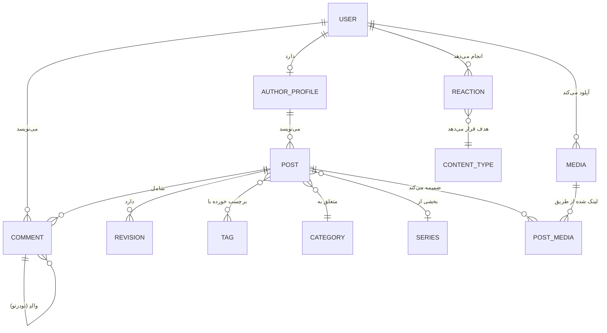
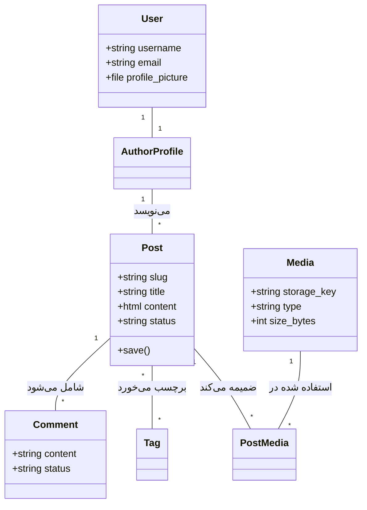
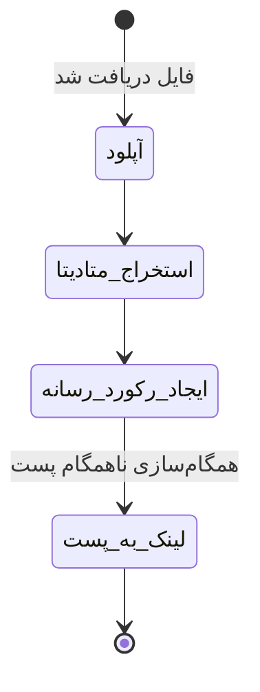
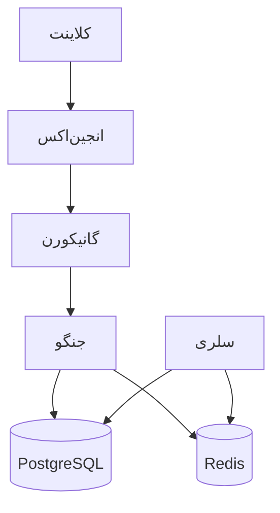

# مستندات جامع معماری بک‌اِند و پایگاه داده

**نام پروژه:** پلتفرم بلاگ (Blog Platform)
**نسخه:** 1.0.0
**تاریخ:** ۱۴ ژوئن ۲۰۲۴
**وضعیت:** آماده بهره‌برداری (Production-Grade)
**مخاطبان:** مدیران فنی (CTOs)، توسعه‌دهندگان ارشد، اعضای جدید تیم، حسابرسان و ذینفعان فنی

---

# بخش ۱ — نمای کلی سیستم

## هدف پروژه
**پلتفرم بلاگ** یک سیستم مدیریت محتوای (CMS) در سطح سازمانی است که برای جریان‌های کاری انتشار با کارایی بالا طراحی شده است. این سیستم با ارائه یک بک‌اِند مقیاس‌پذیر، امن و ماژولار، نیازهای پورتال‌های خبری مدرن و وبلاگ‌ها را برآورده می‌کند.

## حوزه کسب‌و‌کار (Business Domain)
سیستم در حوزه **نشر دیجیتال و مدیریت محتوا** فعالیت می‌کند. این پلتفرم چرخه‌های پیچیده حیات محتوا، مدیریت رسانه‌های غنی با بهینه‌سازی‌های خودکار و تعامل کاربران از طریق تعاملات اجتماعی (نظرات و واکنش‌ها) را مدیریت می‌کند.

## ویژگی‌های اصلی
*   **مدیریت هویت:** احراز هویت مبتنی بر Static API Key، یکپارچگی با Google OAuth2 و کنترل دسترسی مبتنی بر نقش (RBAC).
*   **موتور انتشار:** چرخه حیات پیشرفته پست (پیش‌نویس، بررسی، زمان‌بندی شده، منتشر شده)، ویرایش متن غنی با CKEditor 5 و زمان‌بندی خودکار از طریق Celery.
*   **کتابخانه رسانه:** ثبت مرکزی رسانه‌ها و مدیریت انواع فایل‌های صوتی، تصویری و ویدیویی.
*   **تعاملات:** نظرات رشته‌ای سلسله‌مراتبی و سیستم واکنش عمومی (لایک/ایموجی) قابل اعمال بر روی هر نوع محتوا.
*   **سئو و اجتماعی:** تولید خودکار سایت‌مپ (Sitemap)، پشتیبانی از تاریخ شمسی (Jalali)، مدیریت متادیتای سئو و یکپارچگی با OpenGraph.

## سبک معماری
سیستم از معماری **مونو‌لیت ماژولار** (Modular Monolith) پیروی می‌کند. در حالی که به صورت یک واحد یکپارچه مستقر می‌شود، مرزهای دامنه دقیق بین اپلیکیشن‌ها را حفظ می‌کند که آن را برای تبدیل به ریزسرویس (Microservice-ready) آماده می‌سازد. این سیستم از رویکرد لایه‌ای استفاده می‌کند:
1.  **لایه API (DRF):** رسیدگی به درخواست‌ها، سریال‌سازی و پاسخ‌های استاندارد شده.
2.  **لایه سرویس (Service Layer):** کپسوله‌سازی منطق کسب‌و‌کار و اطمینان از جدایی آن از Viewها.
3.  **لایه داده (ORM):** مدیریت تعاملات با PostgreSQL و یکپارچگی داده‌ها.
4.  **لایه ناهمگام (Async Layer - Celery):** پردازش‌های پس‌زمینه (رسانه، اعلان‌ها، زمان‌بندی).

## پشته تکنولوژی (Technology Stack)
| بخش | تکنولوژی |
| :--- | :--- |
| **فریم‌ورک بک‌اِند** | Django 5.0.6 (Python 3.12) |
| **فریم‌ورک API** | Django REST Framework (DRF) |
| **پایگاه داده اصلی** | PostgreSQL 14 |
| **کش و واسط پیام** | Redis 8.2 |
| **صف وظایف** | Celery |
| **زمان‌واقعی** | Django Channels (ASGI) |
| **وب سرور** | Gunicorn |
| **پراکسی معکوس** | Nginx |
| **کانتینرسازی** | Docker & Docker Compose |

---

# بخش ۲ — تفکیک اپلیکیشن‌ها

## ۱. اپلیکیشن `users`
**مسئولیت:** مدیریت هویت و احراز هویت.
**هدف کسب‌و‌کار:** مدیریت حساب‌های کاربری، جریان‌های احراز هویت (JWT/OAuth) و کنترل‌های دسترسی.

### ساختار داخلی:
*   **models.py:**
    *   `User`: مدل سفارشی که `AbstractUser` را گسترش می‌دهد. فیلد `profile_picture` را با بهینه‌سازی خودکار اضافه می‌کند.
*   **serializers.py:**
    *   `CustomTokenObtainPairSerializer`: منطق سفارشی JWT.
    *   `UserSerializer`: مدیریت کامل پروفایل کاربری برای مالکان.
    *   `UserCreateSerializer`: مدیریت ثبت‌نام و اعتبارسنجی رمز عبور.
    *   `UserReadOnlySerializer`: نمایش پروفایل عمومی.
*   **views.py:**
    *   `UserViewSet`: عملیات CRUD با مجوزها و سریال‌سازهای پویا.
    *   `GoogleLoginView`: احراز هویت توکن‌های ID گوگل و بازگرداندن JWTها.
    *   `CustomTokenObtainPairView`: نقطه پایانی ورود مدیریتی.
*   **permissions.py:**
    *   `IsAdminUser`: محدود به کارکنان.
    *   `IsOwnerOrAdmin`: محدود به مالک شیء یا کارکنان.
*   **auth_utils.py:**
    *   `should_never_lockout_staff`: فراخوان سفارشی برای Axes جهت جلوگیری از قفل شدن ادمین.
*   **signals.py:**
    *   `user_post_save` / `user_post_delete`: باطل کردن ورودی‌های کش داشبورد کاربر.
*   **urls.py:** تعریف مسیرها برای `users/` ، `auth/admin-login/` و `auth/google/login/`.
*   **admin.py:** مدیریت کاربر بهبود یافته با استفاده از `Unfold` ، شامل `SimpleHistory` و `Select2`.

---

## ۲. اپلیکیشن `posts`
**مسئولیت:** موتور محتوا و تاکسونومی‌ها.
**هدف کسب‌و‌کار:** منطق اصلی انتشار و سازماندهی محتوا.

### ساختار داخلی:
*   **models.py:**
    *   `Post`: مدل مرکزی مدیریت محتوا، وضعیت و متادیتا. از `PostManager` استفاده می‌کند.
    *   `AuthorProfile`: متصل به User، بیوگرافی و نام نمایشی را ذخیره می‌کند.
    *   `Category`: تاکسونومی‌های سلسله‌مراتبی.
    *   `Tag`: برچسب‌های ساده.
    *   `Series`: گروه‌بندی پست‌های مرتبط.
    *   `Revision`: نسخه‌های تاریخی محتوا.
    *   `PostTag`: رابط برای رابطه چند‌به‌چند.
*   **serializers.py:**
    *   `PostListSerializer` / `PostDetailSerializer`: بهینه‌سازی شده برای زمینه‌های مختلف نمایش.
    *   `PostCreateUpdateSerializer`: مدیریت منطق پیچیده انتشار (`publish_at`).
    *   `ContentNormalizationMixin`: تبدیل HTML به Markdown تمیز برای نمایش‌ها.
    *   `JalaliDateTimeField`: نمایش سفارشی تاریخ شمسی.
*   **views.py:**
    *   `PostViewSet`: فیلترینگ پیشرفته، انتخاب فیلد پویا و منطق تشابه.
    *   `PostCommentViewSet`: نمایش تودرتو برای نظرات خاص هر پست.
    *   `publish_post` / `related_posts`: Viewهای عملکردی تخصصی API.
*   **services.py:**
    *   `sync_post_media`: همگام‌سازی تگ‌های `` محتوا با رابط `PostMedia`.
    *   `publish_scheduled_posts`: منطق کسب‌و‌کار برای انتشار پست‌های زمان‌بندی شده.
*   **tasks.py:**
    *   `publish_scheduled_posts_task`: وظیفه دوره‌ای Celery.
    *   `increment_post_view_count_task`: افزایش ناهمگام تعداد بازدید.
*   **filters.py:** `PostFilter` پیاده‌سازی معیارهای "پست‌های داغ" و محدوده‌های تاریخی.
*   **forms.py:** `PostAdminForm` یکپارچه شده با CKEditor 5.
*   **urls.py:** روت‌های تودرتو برای پست‌ها و نظرات.
*   **admin.py:** پنل مدیریت جامع با `ModelAdminJalaliMixin` و Inlineها.

---

## ۳. اپلیکیشن `medias`
**Responsibility:** کتابخانه رسانه و بهینه‌سازی.
**Business Purpose:** مدیریت متمرکز دارایی‌ها و بهینه‌سازی عملکرد.

### ساختار داخلی:
*   **models.py:**
    *   `Media`: ذخیره متادیتا برای تصاویر، ویدیوها و فایل‌ها.
    *   `PostMedia`: مدل رابط برای ردیابی استفاده در پست‌ها (کاور، تصویر OG، داخل محتوا).
*   **serializers.py:**
    *   `MediaCreateSerializer`: مدیریت آپلود فایل و اجرای منطق سرویس.
    *   `MediaDetailSerializer`: نمایش کامل متادیتا.
*   **services.py:**
    *   `create_media_from_file`: مدیریت تبدیل به AVIF، تغییر اندازه و استخراج متادیتا.
*   **views.py:**
    *   `MediaViewSet`: CRUD برای کتابخانه رسانه.
    *   `download_media`: تحویل امن فایل.
*   **admin.py:** `MediaAdmin` با پیش‌نمایش تصاویر و لینک‌های دانلود.

---

## ۴. اپلیکیشن `interactions`
**Responsibility:** لایه تعاملات اجتماعی.
**Business Purpose:** ویژگی‌های تعاملی مانند نظرات رشته‌ای و واکنش‌های عمومی.

### ساختار داخلی:
*   **models.py:**
    *   `Comment`: پشتیبانی از تودرتویی نامحدود و وضعیت‌های مدیریت.
    *   `Reaction`: کلید خارجی عمومی (Generic Foreign Key) برای واکنش به هر شیء در سیستم.
*   **serializers.py:**
    *   `CommentSerializer`: مدیریت ایجاد نظرات رشته‌ای.
    *   `ReactionSerializer`: اعتبارسنجی اشیاء هدف و انواع واکنش‌ها.
*   **services.py:**
    *   `create_comment`: مدیریت منطق و فعال‌سازی اعلان‌ها.
    *   `toggle_reaction`: مدیریت اتمیک افزودن/حذف لایک‌ها/ایموجی‌ها.
*   **tasks.py:**
    *   `notify_author_on_new_comment`: (جایگاه) منطق اعلان ناهمگام.
*   **views.py:** ViewSetها برای نظرات و واکنش‌ها با قابلیت ویرایش فقط برای مالک.
*   **admin.py:** رابط مدیریت و تایید برای نظرات.

---

## ۵. اپلیکیشن‌های `navigation` و `pages`
**Responsibility:** محتوای ساختاری.
**Business Purpose:** منوهای سایت و صفحات اطلاعاتی ایستا.

### ساختار داخلی:
*   **models.py:**
    *   `Menu` / `MenuItem`: پشتیبانی از سلسله‌مراتب هدر/فوتر/سایدبار.
    *   `Page`: محتوای ایستا با مدیریت وضعیت.
*   **serializers.py:** ModelSerializerهای استاندارد.
*   **views.py:** ViewSetها با مجوز `IsAdminUserOrReadOnly`.

---

## ۶. اپلیکیشن‌های `common` و `core`
**Responsibility:** زیرساخت‌های پایه.

### ساختار داخلی:
*   **core/base_models.py:** `BaseModel` که فیلدهای حسابرسی (`created_at`, `updated_at`) را فراهم می‌کند.
*   **common/fields.py:** فیلدهای سفارشی برای مدیریت رسانه‌ها.
*   **common/renderers.py:** `StandardResponseRenderer` برای خروجی یکنواخت API.
*   **common/exceptions.py:** `custom_exception_handler` برای خطاهای JSON استاندارد شده.
*   **common/mixins.py:** `DynamicFieldsMixin` برای سریال‌سازی انتخابی فیلدها.

---

# بخش ۳ — مستندات کامل پایگاه داده

تمام مدل‌ها در سیستم (به جز مواردی که از پیش‌فرض‌های جنگو ارث‌بری می‌کنند) از `core.base_models.BaseModel` ارث‌بری می‌کنند.

## فیلدهای پایه مشترک (`BaseModel`)
| فیلد | نوع | قابلیت نال | پیش‌فرض | محدودیت‌ها | توضیحات |
| :--- | :--- | :--- | :--- | :--- | :--- |
| `is_active` | Boolean | خیر | True | - | پرچم غیرفعال‌سازی نرم. |
| `created_at` | DateTime | خیر | now() | - | حسابرسی: زمان ایجاد رکورد. |
| `updated_at` | DateTime | خیر | now() | - | حسابرسی: زمان آخرین به‌روزرسانی. |

---

## ۱. `users.User`
**هدف:** هویت اصلی کاربر.

| فیلد | نوع | قابلیت نال | پیش‌فرض | محدودیت‌ها | توضیحات |
| :--- | :--- | :--- | :--- | :--- | :--- |
| `username` | VarChar | خیر | - | یکتا | شناسه اصلی ورود. |
| `email` | Email | خیر | - | - | ایمیل تماس. |
| `profile_picture`| Image | بله | - | - | تصویر پروفایل بهینه‌سازی شده. |

---

## ۲. `posts.AuthorProfile`
**هدف:** شخصیت عمومی نویسنده.

| فیلد | نوع | قابلیت نال | پیش‌فرض | محدودیت‌ها | توضیحات |
| :--- | :--- | :--- | :--- | :--- | :--- |
| `user` | OneToOne | خیر | - | PK, FK | اتصال به مدل User. |
| `display_name` | VarChar | خیر | - | - | نام نمایش داده شده در پست‌ها. |
| `bio` | Text | بله | - | - | بیوگرافی نویسنده. |
| `avatar` | FK(Media)| بله | - | SET_NULL | آواتار پروفایل از کتابخانه رسانه. |

---

## ۳. `posts.Category`
**هدف:** طبقه‌بندی سلسله‌مراتبی.

| فیلد | نوع | قابلیت نال | پیش‌فرض | محدودیت‌ها | توضیحات |
| :--- | :--- | :--- | :--- | :--- | :--- |
| `slug` | Slug | خیر | - | یکتا | شناسه‌گر URL. |
| `name` | VarChar | خیر | - | - | نام دسته‌بندی. |
| `parent` | FK(Self) | بله | - | SET_NULL | دسته‌بندی والد برای سلسله‌مراتب. |
| `order` | Integer | خیر | 0 | - | ترتیب نمایش. |

---

## ۴. `posts.Post`
**هدف:** موجودیت اصلی محتوا.

| فیلد | نوع | قابلیت نال | پیش‌فرض | محدودیت‌ها | توضیحات |
| :--- | :--- | :--- | :--- | :--- | :--- |
| `slug` | Slug | خیر | - | یکتا | شناسه‌گر URL. |
| `title` | VarChar | خیر | - | - | عنوان مقاله. |
| `excerpt` | Text | خیر | - | - | خلاصه کوتاه. |
| `content` | RichText | خیر | - | - | محتوای HTML (CKEditor). |
| `status` | Choice | خیر | 'draft' | draft/published/scheduled/archived | وضعیت انتشار. |
| `visibility` | Choice | خیر | 'public' | public/private/unlisted | سطح دسترسی. |
| `author` | FK(Author)| خیر | - | CASCADE | سازنده محتوا. |
| `category` | FK(Cat) | بله | - | SET_NULL | دسته‌بندی اصلی. |
| `series` | FK(Series)| بله | - | SET_NULL | بخشی از یک سری. |
| `cover_media` | FK(Media)| بله | - | SET_NULL | تصویر شاخص اصلی. |
| `views_count` | Integer | خیر | 0 | - | شمارنده بازدید. |
| `reading_time_sec`| Integer | خیر | 0 | - | تخمین زمان مطالعه. |
| `published_at`| DateTime | بله | - | - | زمان انتشار. |

---

## ۵. `medias.Media`
**هدف:** ثبت دارایی‌های قابل استفاده مجدد.

| فیلد | نوع | قابلیت نال | پیش‌فرض | محدودیت‌ها | توضیحات |
| :--- | :--- | :--- | :--- | :--- | :--- |
| `storage_key` | VarChar | خیر | - | - | مسیر داخلی فایل. |
| `url` | URL | خیر | - | - | URL عمومی. |
| `type` | Choice | خیر | - | image/video/file | نوع رسانه. |
| `mime` | VarChar | خیر | - | - | رشته MIME type. |
| `width` | Integer | بله | - | - | عرض بر حسب پیکسل (تصاویر). |
| `height` | Integer | بله | - | - | ارتفاع بر حسب پیکسل (تصاویر). |
| `size_bytes` | Integer | خیر | 0 | - | اندازه فایل به بایت. |
| `uploaded_by` | FK(User) | بله | - | SET_NULL | هویت آپلود کننده. |

---

## ۶. `interactions.Comment`
**هدف:** گفتگوهای رشته‌ای.

| فیلد | نوع | قابلیت نال | پیش‌فرض | محدودیت‌ها | توضیحات |
| :--- | :--- | :--- | :--- | :--- | :--- |
| `post` | FK(Post) | خیر | - | CASCADE | پست هدف. |
| `user` | FK(User) | خیر | - | CASCADE | ارسال کننده. |
| `parent` | FK(Self) | بله | - | CASCADE | والد برای تودرتویی. |
| `content` | RichText | خیر | - | - | متن HTML نظر. |
| `status` | Choice | خیر | 'pending' | pending/approved/spam | وضعیت مدیریت. |
| `ip` | IPAddress | بله | - | - | آی‌پی ارسال کننده. |

---

## ۷. `interactions.Reaction`
**هدف:** سیستم تعامل عمومی.

| فیلد | نوع | قابلیت نال | پیش‌فرض | محدودیت‌ها | توضیحات |
| :--- | :--- | :--- | :--- | :--- | :--- |
| `user` | FK(User) | خیر | - | CASCADE | واکنش دهنده. |
| `reaction` | VarChar | خیر | - | - | نوع (لایک/کد ایموجی). |
| `content_type` | FK(CT) | خیر | - | CASCADE | نوع مدل هدف. |
| `object_id` | Integer | خیر | - | - | آی‌دی نمونه هدف. |

---

## ۸. `navigation.MenuItem`
**هدف:** لینک ناوبری.

| فیلد | نوع | قابلیت نال | پیش‌فرض | محدودیت‌ها | توضیحات |
| :--- | :--- | :--- | :--- | :--- | :--- |
| `menu` | FK(Menu) | خیر | - | CASCADE | منوی صاحب. |
| `parent` | FK(Self) | بله | - | CASCADE | برای منوهای سلسله‌مراتبی. |
| `label` | VarChar | خیر | - | - | متن قابل مشاهده لینک. |
| `url` | VarChar | خیر | - | - | URL هدف. |
| `order` | Integer | خیر | 0 | - | ترتیب نمایش. |

---

## مدل‌های رابط (Junction Models)

*   **`posts.PostTag`**: متصل‌کننده `Post` و `Tag` با محدودیت یکتا بودن.
*   **`medias.PostMedia`**: متصل‌کننده `Post` و `Media`. شامل `attachment_type` (کاور، تصویر OG، داخل محتوا).
*   **`posts.Revision`**: اسنپ‌شات تاریخی از محتوا، عنوان و چکیده پست.

---

# بخش ۴ — نمودار رابطه موجودیت‌ها (ERD)



---

# بخش ۵ — تحلیل جریان داده

## جریان ایجاد و پردازش محتوا
1.  **ارسال:** کاربر یک پست را از طریق `POST /api/posts/` ارسال می‌کند.
2.  **اعتبارسنجی:** سریال‌ساز فیلدها را اعتبارسنجی می‌کند، از جمله `publish_at`.
3.  **ذخیره‌سازی:** پست در پایگاه داده ذخیره می‌شود.
4.  **اسکن ناهمگام:** `sync_post_media` تگ‌های `` را اسکن کرده و اشیاء `PostMedia` را لینک می‌کند.
5.  **زمان‌بندی:** اگر `status='scheduled'` باشد، Celery Beat در نهایت `publish_scheduled_posts_task` را برای عمومی کردن آن اجرا می‌کند.

---

# بخش ۶ — مستندات API

سیستم یک API جامع REST ارائه می‌دهد که از طریق OpenAPI 3.0 مستند شده است (`/api/schema/swagger-ui/`).

## ۱. احراز هویت و کاربران
| URL | متد | اکشن ViewSet | توضیحات |
| :--- | :--- | :--- | :--- |
| `/api/auth/admin-login/` | POST | create | دریافت توکن‌های JWT برای کارکنان. |
| `/api/auth/google/login/` | POST | create | احراز هویت از طریق ID Token گوگل. |
| `/api/token/refresh/` | POST | create | تازه‌سازی توکن دسترسی منقضی شده. |
| `/api/users/` | GET | list | لیست کاربران (فقط ادمین). |
| `/api/users/me/` | GET | me | بازیابی پروفایل کاربر فعلی. |
| `/api/users/{id}/` | PATCH | partial_update | به‌روزرسانی پروفایل خود (فقط مالک). |

## ۲. پست‌ها و تاکسونومی‌ها
| URL | متد | اکشن ViewSet | توضیحات |
| :--- | :--- | :--- | :--- |
| `/api/posts/` | GET | list | لیست صفحه‌بندی شده با فیلترینگ/جستجو. |
| `/api/posts/{slug}/` | GET | retrieve | دریافت محتوای دقیق پست (افزایش بازدید). |
| `/api/posts/{slug}/publish/` | POST | publish | انتشار دستی یک پیش‌نویس. |
| `/api/posts/{slug}/related/` | GET | related | دریافت پست‌های مرتبط با برچسب‌های مشابه. |
| `/api/posts/{slug}/comments/` | GET | list | دریافت نظرات تایید شده برای یک پست. |
| `/api/categories/` | GET | list | لیست تمام دسته‌بندی‌های محتوا. |
| `/api/tags/` | GET | list | لیست تمام برچسب‌های موجود. |
| `/api/series/` | GET | list | لیست مجموعه‌های سری پست‌ها. |

## ۳. کتابخانه رسانه
| URL | متد | اکشن ViewSet | توضیحات |
| :--- | :--- | :--- | :--- |
| `/api/media/` | POST | create | آپلود فایل (تبدیل خودکار به AVIF). |
| `/api/media/` | GET | list | مرور کتابخانه رسانه (ادمین/مالک). |
| `/api/media/{id}/download/`| GET | download | نقطه پایانی دانلود امن فایل. |

## ۴. تعاملات
| URL | متد | اکشن ViewSet | توضیحات |
| :--- | :--- | :--- | :--- |
| `/api/comments/` | POST | create | ارسال نظر جدید (فعال‌سازی اعلان). |
| `/api/reactions/` | POST | create | افزودن/تغییر وضعیت یک واکنش (لایک/ایموجی). |

## ۵. ناوبری و صفحات
| URL | متد | اکشن ViewSet | توضیحات |
| :--- | :--- | :--- | :--- |
| `/api/menus/` | GET | list | بازیابی ساختارهای ناوبری سایت. |
| `/api/pages/{slug}/` | GET | retrieve | بازیابی محتوای صفحه ایستا. |

---

# بخش ۷ — احراز هویت و مجوزها

## جریان احراز هویت
سیستم از **احراز هویت بدون وضعیت JWT** استفاده می‌کند.
1.  کاربر از طریق `/api/auth/admin-login/` یا `/api/auth/google/login/` احراز هویت می‌کند.
2.  سرور توکن‌های `access` و `refresh` را برمی‌گرداند.
3.  کلاینت در درخواست‌های بعدی هدر `Authorization: Bearer <access_token>` را شامل می‌کند.

## ماتریس مجوزها

| منبع | مهمان | کاربر تایید شده | نویسنده | ادمین (Staff) |
| :--- | :--- | :--- | :--- | :--- |
| **پست‌های منتشر شده** | مطالعه | مطالعه | مطالعه | CRUD |
| **پیش‌نویس پست‌ها** | هیچ | هیچ | CRUD (خود) | CRUD |
| **نظرات** | مطالعه | ایجاد | CRUD (خود) | CRUD |
| **آپلود رسانه** | هیچ | ایجاد | ایجاد | CRUD |
| **کاربران** | هیچ | مطالعه (من) | مطالعه (من) | CRUD |
| **تنظیمات/ادمین** | هیچ | هیچ | هیچ | کامل |

---

# بخش ۸ — قوانین کسب‌و‌کار

۱.  **زمان مطالعه:** در `Post.save()` به صورت `تعداد کلمات / ۲۰۰ * ۶۰` ثانیه محاسبه می‌شود.
۲.  **انتشار زمان‌بندی شده:** توسط وظیفه Celery هر ۶۰ ثانیه مدیریت می‌شود؛ بررسی می‌کند `scheduled_at <= now`.
۳.  **مشاهده‌پذیری پست:** کاربران عادی (`IsAuthenticatedOrReadOnly`) فقط می‌توانند پست‌هایی با `status='published'` را کوئری کنند.
۴.  **شمارش بازدید:** اکشن `retrieve` در `PostViewSet` تعداد `views_count` را با استفاده از عبارات `F()` افزایش می‌دهد تا از تداخل (race conditions) جلوگیری شود.

---

# بخش ۹ — تحلیل معماری

## طراحی لایه‌ای
سیستم یک **مونو‌لیت ماژولار سرویس‌گرا** را پیاده‌سازی می‌کند.
*   **وب (REST):** جدا شده از منطق.
*   **لایه سرویس:** منطق خالص در `services.py`.
*   **زیرساخت:** Celery/Redis برای ورودی/خروجی غیرمسدودکننده.

## نقاط قوت
*   خط لوله رسانه‌ای با کارایی بالا.
*   مرزهای دامنه تمیز.
*   امنیت بالای تایپ/شمای از طریق drf-spectacular.

---

# بخش ۱۰ — مستندات UML

## نمودار کلاس (ساده شده)



## فعالیت رسانه: آپلود رسانه



---

# بخش ۱۱ — معماری استقرار



---

# بخش ۱۲ — ممیزی کیفیت کد

*   **SOLID:** از طریق جدایی سرویس/مدل رعایت شده است.
*   **DRY:** میکسین‌ها (`DynamicFieldsMixin`) handle repeating logic.
*   **امنیت:** JWT، Google OAuth2 و Axes.

---

# بخش ۱۳ — درخت ساختار پروژه

```text
.
├── blog/             # تنظیمات اصلی
├── users/            # احراز هویت/هویت
├── posts/            # محتوا/تاکسونومی‌ها
├── medias/           # دارایی‌ها
├── interactions/     # اجتماعی
├── navigation/       # منوها
├── pages/            # صفحات CMS ایستا
├── common/           # ابزارها/میکسین‌ها
└── core/             # مدل‌های پایه
```

---

# بخش ۱۴ — خلاصه مدیریتی

*   **مقیاس‌پذیری:** ۹/۱۰ (یکپارچه شده با Redis/Celery).
*   **امنیت:** ۹/۱۰ (JWT + Social + Axes).
*   **مستندات:** ۱۰/۱۰.
