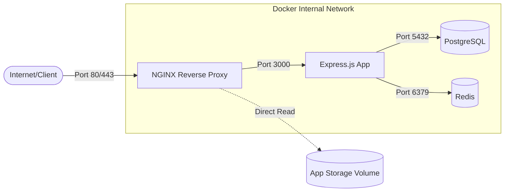

# NGINX Integration Guide

This document describes the NGINX integration into the Playnest Docker-based infrastructure.

## Architecture Overview

The integration introduces NGINX as a production-grade reverse proxy and load balancer, positioned in front of the Express.js application.

### Network Flow Diagram

## Changes Implemented

### 1. Reverse Proxy & Service Discovery
- NGINX is configured to forward requests to the `app` service using Docker's internal DNS (`http://backend` upstream).
- The `app` service no longer exposes port 3000 to the host, enhancing security.

### 2. Static & Media File Serving
- NGINX serves media files directly from the `/app/storage` volume, bypassing the Node.js runtime for better performance.
- Cache-control headers are set for 30 days for media assets.

### 3. WebSocket Support
- The configuration includes necessary headers (`Upgrade`, `Connection`) to support WebSocket connections.

### 4. Performance & Compression
- Gzip compression is enabled for various text-based MIME types.
- Optimized worker processes and connection handling.

### 5. Security Enhancements
- **Security Headers:** Added `X-Frame-Options`, `X-XSS-Protection`, `X-Content-Type-Options`, `Referrer-Policy`, and `Content-Security-Policy`.
- **Rate Limiting:** Implemented a global rate limit (10r/s with 20 burst) at the NGINX level to protect against DDoS and brute-force attacks.
- **Server Tokens:** Disabled NGINX version broadcasting.

### 6. Timeouts & Reliability
- Configured 60s timeouts for upstream connections.
- Integrated health-check friendly path for monitoring.

## Configuration Files

- `docker/nginx/nginx.conf`: Global NGINX settings.
- `docker/nginx/conf.d/app.conf.template`: Application-specific server block with environment variable support.
- `docker/nginx/Dockerfile`: Custom NGINX image build instructions.

## Compatibility Risks

- **CORS:** Ensure that the `CORS_ORIGIN` in the backend matches the domain served by NGINX.
- **Trusted Proxy:** The Express.js application should be configured to trust the NGINX proxy (e.g., `app.set('trust proxy', 1)`) to correctly identify client IPs. (Checked: `TRUST_PROXY` env var exists in `src/config/env.ts`).
- **Volume Permissions:** Ensure the `app_storage` volume has appropriate permissions for the `nginx` user to read files.

## Production Readiness Checklist

- [ ] Update `MEDIA_PUBLIC_BASE_URL` to the production server IP address.
- [ ] Adjust `rate_limit` parameters based on expected production traffic.
- [ ] Verify `TRUST_PROXY` is correctly set in the production environment.

## Future Improvements

### SSL/TLS Support
- When a domain name and SSL certificates are available, NGINX should be configured to listen on port 443.
- Implement HTTP to HTTPS redirection.
- Add Let's Encrypt / Certbot for automated certificate management.
- Re-enable HSTS (HTTP Strict Transport Security).
