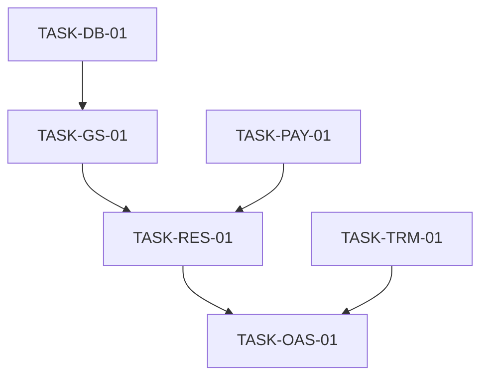

# PHASE 6 — EXECUTION INTELLIGENCE REPORT

## 1. DEPENDENCY MATRIX

| Task ID | Title | Hard Dependencies | Soft Dependencies | Risk Level |
| :--- | :--- | :--- | :--- | :--- |
| **TASK-PAY-01** | Payment Route Fix | None | None | Low |
| **TASK-DB-01** | DB Enum Migration | None | None | Medium |
| **TASK-GS-01** | GamingSession Core (Pause/Resume) | TASK-DB-01 | None | High |
| **TASK-RES-01** | Reservation State Machine | TASK-GS-01 | TASK-PAY-01 | High |
| **TASK-TRM-01** | Terminology Unification | None | TASK-RES-01 | Medium |
| **TASK-OAS-01** | OpenAPI Synchronization | TASK-RES-01, TASK-GS-01 | TASK-TRM-01 | Medium |

### Dependency Graph

---

## 2. CRITICAL PATH ANALYSIS

**Minimum Path to Production (MPP):**
1. **TASK-PAY-01**: Fix broken payment routes (Immediate blocker for integration).
2. **TASK-DB-01**: Update Prisma schema to support `PAUSED` state.
3. **TASK-GS-01**: Implement core session tracking (Start/Pause/Resume/Stop).
4. **TASK-RES-01**: Enforce `IN_PROGRESS` state in Reservation lifecycle.
5. **TASK-OAS-01**: Finalize API contract and documentation.

**Longest Dependency Chain:**
TASK-DB-01 → TASK-GS-01 → TASK-RES-01 → TASK-OAS-01

**Highest Risk Chain:**
GamingSession Logic (TASK-GS-01) → Duration Calculations → Billing Accuracy.

**Highest Business Value Chain:**
Reservation Lifecycle (TASK-RES-01) → Accurate Occupancy Tracking → Reduced Overbooking.

---

## 3. OPTIMIZED EXECUTION QUEUE

| Sequence | Task ID | Priority | Estimated Effort | Why Now? |
| :--- | :--- | :--- | :--- | :--- |
| 1 | **TASK-PAY-01** | 🔴 P0 | 2h | Fixes critical API drift in existing routes. |
| 2 | **TASK-DB-01** | 🔴 P0 | 4h | Unblocks all GamingSession logic (Enums). |
| 3 | **TASK-GS-01** | 🔴 P1 | 8h | Core feature implementation for Phase 6. |
| 4 | **TASK-RES-01** | 🟠 P1 | 6h | Ensures data integrity and state governance. |
| 5 | **TASK-TRM-01** | 🟠 P2 | 12h | Resolves conceptual debt before final release. |
| 6 | **TASK-OAS-01** | 🟡 P2 | 4h | Finalizes the API contract for consumers. |

---

## 4. FILE IMPACT MATRIX

| File Path | Impact | Risk | Change Type |
| :--- | :--- | :--- | :--- |
| `prisma/schema.prisma` | High | Medium | Schema Update (Enum) |
| `src/routes/index.ts` | Medium | Low | Route Refactoring |
| `src/modules/gamingSessions/gamingSessions.station.ts` | High | High | Logic Implementation |
| `src/modules/reservations/reservations.station.ts` | High | High | Lifecycle Refactoring |
| `src/modules/stations/stations.station.ts` | Medium | Medium | Terminology Renaming |
| `src/docs/openapi.yaml` | Medium | Low | Documentation Update |

**Merge Conflict Hotspots:**
- `src/routes/index.ts` (Shared by all modules)
- `src/modules/reservations/reservations.station.ts` (Core business logic)

---

## 5. BLOCKER REGISTER

| Blocker ID | Description | Classification | Impact |
| :--- | :--- | :--- | :--- |
| **BLK-TEC-001** | Missing `PAUSED` enum in `GamingSessionStatus`. | Critical | Blocks TASK-GS-01. |
| **BLK-ARC-001** | Undefined "Auto-Stop" policy for abandoned sessions. | High | Risk of infinite sessions. |
| **BLK-PRO-001** | Outdated OpenAPI spec for Payment routes. | High | Blocks frontend integration. |

---

## 6. MISSING WORK REGISTER

| Category | Missing Task | Priority | Discovery Source |
| :--- | :--- | :--- | :--- |
| **Migrations** | Create migration for `GamingSessionStatus.PAUSED`. | 🔴 Critical | Phase 5 Gap Analysis |
| **Logic** | Implement `resumeSession` in `GamingSessionsStation`. | 🔴 Critical | Code Audit (Missing) |
| **Logic** | Implement centralized `ReservationStateMachine`. | 🟠 High | Phase 4 Architecture |
| **Tests** | Unit tests for `actualHours` duration math. | 🟠 High | Test Coverage Report |
| **Documentation** | Update OAS to include `/sessions/pause` and `/resume`. | 🟡 Medium | API Drift Audit |

---

## 7. SPRINT PLAN (2 BE + 1 QA)

### Sprint 1: Foundation & Connectivity
- **Goal:** Fix routing and prepare database.
- **Tasks:** TASK-PAY-01, TASK-DB-01, Setup integration test harness.
- **Story Points:** 12
- **Risks:** Migration locking in production-like environments.
- **Dependencies:** Infrastructure readiness.

### Sprint 2: Core Usage Tracking
- **Goal:** Implement full GamingSession lifecycle.
- **Tasks:** TASK-GS-01 (Start, Pause, Resume, Stop), Unit tests for duration math.
- **Story Points:** 24
- **Risks:** Logic complexity in multi-pause scenarios.
- **Dependencies:** Sprint 1 completion.

### Sprint 3: Lifecycle & State Governance
- **Goal:** Enforce strict Reservation transitions.
- **Tasks:** TASK-RES-01 (State Machine), Cancel/No-Show logic.
- **Story Points:** 20
- **Risks:** Breaking existing direct CONFIRMED -> COMPLETED transitions.
- **Dependencies:** Sprint 2 completion.

### Sprint 4: Domain Alignment & QA
- **Goal:** Unified terminology and 100% contract compliance.
- **Tasks:** TASK-TRM-01, TASK-OAS-01, Final E2E Regression.
- **Story Points:** 18
- **Risks:** Large file-count changes (Renaming).
- **Dependencies:** Sprint 3 completion.

---

## 8. RELEASE TRAIN DESIGN

| Release | Milestone | Scope | Entry Criteria | Exit Criteria | Rollback Plan |
| :--- | :--- | :--- | :--- | :--- | :--- |
| **v1.1** | Foundation | Payments Fix + DB Schema | Design Approved | 100% Integration tests pass. | Revert Express routes & DB migration. |
| **v1.2** | Tracking | GamingSession Pause/Resume | v1.1 Staged | Duration math validated. | Revert Station logic changes. |
| **v1.3** | Governance | Reservation State Machine | v1.2 Staged | No invalid transitions possible. | Revert State Machine integration. |
| **v1.4** | Standardization | Terminology + OpenAPI 3.0 | v1.3 Staged | Zero API Drift detected. | Revert global search/replace. |

---

## 9. QUALITY GATE SYSTEM

| Gate | Criteria | Measurement |
| :--- | :--- | :--- |
| **Development** | OpenAPI Sync | `npm run api:validate` = Pass |
| **Development** | Unit Coverage | Logic Layer > 90% |
| **Testing** | Integration Tests | 100% Success on DB Transactions |
| **Release** | E2E Scenario | Reservation -> Session -> Payment flow |
| **Post Release** | Health Monitoring | Error Rate < 0.1%, Zero drift on live contracts |

---

## 10. ENGINEERING HEALTH ASSESSMENT

- **Architecture Readiness:** 85/100 (Well-defined aggregates).
- **Development Readiness:** 70/100 (Some missing logic stubs).
- **Testing Readiness:** 65/100 (Unit tests needed for new logic).
- **Production Readiness:** 60/100 (Pending state machine enforcement).

**Delivery Readiness Score: 70/100**

---

## 11. RESOLUTION PLAN

| Problem | Recommended Fix | Effort | Priority | Owner | Resolution Order |
| :--- | :--- | :--- | :--- | :--- | :--- |
| **Enum Missing** | Run `npx prisma migrate dev` with new enum values. | 1h | 🔴 Critical | DevOps | 1 |
| **Pause Logic** | Implement `pausedMinutes` accumulation in `gamingSessions.station`. | 4h | 🔴 Critical | BE Architect | 2 |
| **API Drift** | Automated contract testing using `jest-openapi`. | 6h | 🟠 High | QA Lead | 4 |
| **Terminology** | Use IDE-wide refactoring with manual check on public APIs. | 8h | 🟠 High | Staff BE | 3 |
