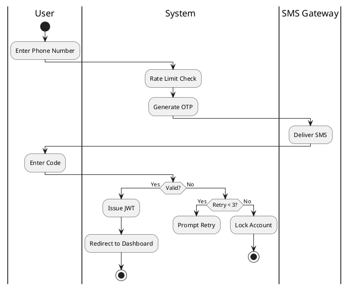
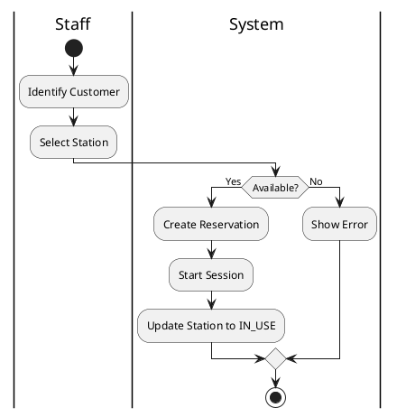
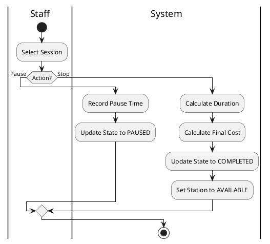
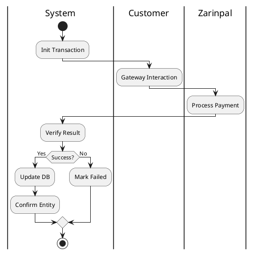

# Playenest Activity Diagram Specifications

This document provides a comprehensive workflow modeling of the Playenest platform using UML 2.x standards.

---

## TASK 1 – Identify Activity Diagram Candidates

The following processes have been identified as candidates for Activity Diagram modeling due to their workflow complexity and criticality to the business.

| Activity ID | Process Name | Related Use Case | Complexity | Priority | Classification |
| :--- | :--- | :--- | :--- | :--- | :--- |
| **AD-001** | User Authentication (OTP) | UC-001, UC-002 | Low | High | Critical Process |
| **AD-002** | Online Station Booking | UC-004, UC-016 | High | High | Critical Process |
| **AD-003** | Walk-in Booking & Start | UC-005, UC-006 | Medium | High | Core Business Process |
| **AD-004** | Gaming Session Management | UC-006, UC-007, UC-008 | Medium | High | Critical Process |
| **AD-005** | Online Payment Processing | UC-016 | Medium | High | Critical Process |
| **AD-006** | Wallet Recharge & Refund | UC-015, UC-017 | Medium | Medium | Supporting Process |
| **AD-007** | Station Maintenance Update | UC-013 | Low | Medium | Administrative Process |

---

## TASK 2 – Workflow Decomposition

### AD-001: User Authentication (OTP)
**Process:** User Authentication (OTP)
**Activities:**
1. Enter Phone Number
2. Request OTP
3. System Generates & Sends OTP
4. Enter Received OTP
5. System Validates OTP
6. Issue Session JWT
7. Redirect to Dashboard

**Decisions:**
D1. Is Phone Number Valid?
D2. Is OTP Correct?
D3. Is OTP Expired?
D4. Retry Limit Reached?

**Exceptions:**
E1. SMS Gateway Failure
E2. Rate Limit Exceeded
E3. Authentication Lockout (Too many attempts)

---

### AD-002: Online Station Booking
**Process:** Online Station Booking
**Activities:**
1. Browse Landing Page
2. Select Station Type & Time Slot
3. System Validates Availability
4. Authenticate (OTP)
5. Choose Payment Method
6. Process Payment (Online/Wallet)
7. Confirm Booking
8. Notify Customer

**Decisions:**
D1. Is Station Available?
D2. Is User Logged In?
D3. Payment Method Choice (Online vs Wallet)
D4. Payment Successful?

**Exceptions:**
E1. Station Unavailable (Conflict)
E2. Payment Failed
E3. Authentication Failed

---

### AD-003: Walk-in Booking & Start
**Process:** Walk-in Booking & Start
**Activities:**
1. Customer Arrives at Center
2. Staff Checks Availability
3. Select Available Station
4. Identify Customer (Phone/Name)
5. Create Immediate Reservation
6. Start Gaming Session
7. Update Station Status to 'IN_USE'

**Decisions:**
D1. Customer Already Registered?
D2. Station Available Now?
D3. Payment Upfront Required?

**Exceptions:**
E1. Center at Full Capacity
E2. System Offline

---

### AD-004: Gaming Session Management
**Process:** Gaming Session Management
**Activities:**
1. Select Active/Pending Reservation
2. Start Session
3. Monitor Play Time
4. Request Pause/Resume (Optional)
5. Request Change Station (Optional)
6. Stop Session (Check-out)
7. Finalize Billing

**Decisions:**
D1. Start or Pause?
D2. Station Change Required?
D3. Time Limit Reached?

**Exceptions:**
E1. Station Hardware Failure
E2. Insufficient Funds (for pay-as-you-go scenarios)

---

### AD-005: Online Payment Processing
**Process:** Online Payment Processing
**Activities:**
1. Generate Unique Transaction ID
2. Prepare Payment Payload (Amount, Callback)
3. Redirect to Zarinpal Gateway
4. Customer Completes Payment
5. Receive Webhook/Callback from Zarinpal
6. Verify Transaction via Zarinpal API
7. Update Transaction Status in DB
8. Finalize Linked Entity (Reservation/Wallet)

**Decisions:**
D1. Webhook or Callback?
D2. Verification Successful?
D3. Transaction Already Processed (Idempotency)?

**Exceptions:**
E1. Gateway Timeout
E2. Invalid Signature
E3. Mismatched Amount

---

### AD-006: Wallet Recharge & Refund
**Process:** Wallet Recharge & Refund
**Activities:**
1. Request Wallet Action
2. Input Amount
3. Process Payment (if recharge)
4. Update Wallet Balance Atomically
5. Create Wallet Transaction Log
6. Notify Customer

**Decisions:**
D1. Recharge or Refund?
D2. Refund Authorized?
D3. Payment Confirmed (for recharge)?

**Exceptions:**
E1. Atomic Update Failure (Concurrency)
E2. Insufficient Admin Permissions (for refunds)

---

### AD-007: Station Maintenance Update
**Process:** Station Maintenance Update
**Activities:**
1. Identify Hardware Issue
2. Access Station Management
3. Mark Station as 'OUT_OF_ORDER'
4. Provide Reason/Notes
5. Save Update
6. System Blocks Future Bookings for this Station

**Decisions:**
D1. Active Session on Station?
D2. Future Reservations Exist?

**Exceptions:**
E1. Cannot Close Active Session

---

## TASK 3 – Activity Flow Specification

### AD-001: User Authentication (OTP)
**Objective:** Securely authenticate users using their mobile phone number.
**Trigger:** User attempts to login or access a protected route.
**Inputs:** Phone Number.
**Outputs:** JWT Token, User Profile.
**Preconditions:** None (for new users) or existing account.
**Normal Flow:**
1. User enters phone number.
2. System validates format and rate limits.
3. System triggers SMS Gateway.
4. User receives and enters 6-digit code.
5. System verifies code and expiry.
6. System identifies role and returns token.
**Alternative Flow:**
A1. Resend OTP: User requests new code after 120 seconds.
**Exception Flow:**
E1. Invalid OTP: System increments retry counter and prompts again.
E2. Rate Limit: System blocks requests for 5 minutes after 5 attempts.

### AD-002: Online Station Booking
**Objective:** To allow a customer to reserve a station for a future time slot.
**Trigger:** Customer accesses the public booking page.
**Inputs:** Station Type, Start Time, Duration, Phone Number.
**Outputs:** Confirmed Reservation, Transaction Record.
**Preconditions:** Center is open; Stations exist.
**Normal Flow:**
1. Customer selects station type and time.
2. System checks for overlaps (BR-004, FR-006).
3. System shows price snapshot.
4. Customer authenticates (AD-001).
5. Customer pays via Online Payment (AD-005).
6. System marks reservation as 'CONFIRMED'.
**Alternative Flow:**
A1. Wallet Payment: Deduct from balance if sufficient.
**Exception Flow:**
E1. Overlap Found: Suggest alternative times.

### AD-003: Walk-in Booking & Start
**Objective:** Immediate station assignment for arriving customers.
**Trigger:** Customer walks into the gaming center.
**Inputs:** Customer Phone, Station ID.
**Outputs:** Active Gaming Session.
**Preconditions:** Staff is logged in; Station is 'AVAILABLE'.
**Normal Flow:**
1. Staff selects an available station.
2. Staff enters customer phone.
3. System creates reservation and session simultaneously.
4. Session state becomes 'ACTIVE'.
**Exception Flow:**
E1. Station not ready: Staff must clear previous session first.

### AD-004: Gaming Session Management
**Objective:** Manage the lifecycle of an active gaming session.
**Trigger:** Session start, pause, or stop request.
**Inputs:** Session ID, Action (Pause/Stop/StationChange).
**Outputs:** Updated Session State.
**Preconditions:** Session exists.
**Normal Flow:**
1. Staff monitors active sessions.
2. Staff stops session upon customer request.
3. System calculates total time and cost.
4. Station status returns to 'AVAILABLE'.
**Exception Flow:**
E1. Hardware fail: Move session to another station (AD-009).

### AD-005: Online Payment Processing
**Objective:** Handle financial transactions with Zarinpal.
**Trigger:** Payment request for Reservation or Wallet.
**Inputs:** Amount, Description.
**Outputs:** Transaction ID, Gateway URL.
**Preconditions:** Valid merchant config.
**Normal Flow:**
1. System initiates transaction with Zarinpal.
2. User is redirected to Zarinpal.
3. Upon return, System verifies transaction status.
4. System updates database and linked entity.
**Exception Flow:**
E1. Payment Failed: User is redirected back to retry.

### AD-006: Wallet Recharge & Refund
**Objective:** Manage customer's virtual funds.
**Trigger:** Customer recharge or Manager refund.
**Inputs:** Amount, Customer ID.
**Outputs:** Updated Balance, Transaction Log.
**Normal Flow:**
1. (Recharge) User pays via gateway.
2. System adds amount to wallet balance.
3. (Refund) Manager selects reservation and clicks refund.
4. System credits wallet and voids reservation.
**Exception Flow:**
E1. DB Lock: Retry transaction on concurrency error.

### AD-007: Station Maintenance Update
**Objective:** Mark hardware as unavailable.
**Trigger:** Hardware failure or scheduled maintenance.
**Inputs:** Station ID, Status.
**Outputs:** Updated Station State.
**Normal Flow:**
1. Manager selects station.
2. Sets status to 'OUT_OF_ORDER'.
3. System removes station from public availability.
**Exception Flow:**
E1. Ongoing Session: Must stop session before maintenance.

---

## TASK 4 – Swimlane Identification

### AD-001: Authentication Allocation
**Lane 1: User** (Input Phone, Input OTP)
**Lane 2: System** (Rate Limit, Generate OTP, Validate, Issue JWT)
**Lane 3: SMS Gateway** (Deliver SMS)

### AD-002: Online Booking Allocation
**Lane 1: Customer** (Browse, Select, Auth, Pay)
**Lane 2: System** (Check Overlap, Calculate Price, Create Reservation)
**Lane 3: Zarinpal** (Payment Processing)

### AD-003: Walk-in Booking Allocation
**Lane 1: Staff** (Select Station, Enter Phone, Start Session)
**Lane 2: System** (Create Res, Start Session, Update Station)

### AD-004: Session Management Allocation
**Lane 1: Staff** (Start, Pause, Stop, Change Station)
**Lane 2: System** (Verify, Timer Control, Cost Calculation, State Update)

### AD-005: Online Payment Allocation
**Lane 1: Customer** (Gateway Interaction)
**Lane 2: System** (Initiate, Verify, Finalize)
**Lane 3: Zarinpal** (Gateway UI, Payment Result)

### AD-006: Wallet Allocation
**Lane 1: Customer** (Request Recharge)
**Lane 2: Manager** (Authorize Refund)
**Lane 3: System** (Atomic Update, Log Transaction)

### AD-007: Maintenance Allocation
**Lane 1: Manager** (Mark Maintenance, Add Notes)
**Lane 2: System** (State Update, Availability Sync)

---

## TASK 5 – Decision Logic Analysis

| Decision ID | Condition | True Path | False Path | Business Rule |
| :--- | :--- | :--- | :--- | :--- |
| **D-001-1** | OTP Valid? | Issue JWT | Show Error | FR-002 |
| **D-002-1** | Station Available? | Proceed to Auth | Show Error | BR-004 |
| **D-002-2** | Payment Success? | Confirm Booking | Release Slot | BR-002 |
| **D-003-1** | User Exists? | Link to Profile | Create Profile | FR-007 |
| **D-004-1** | Start Allowed? | Activate Session | Deny Start | BR-001 |
| **D-005-1** | Verify OK? | Finalize Entity | Mark Failed | FR-012 |
| **D-006-1** | Refund Valid? | Credit Wallet | Rejection | BR-005 |
| **D-007-1** | Station Busy? | Deny Maint. | Mark OOO | - |

---

## TASK 6 – Parallel Process Analysis

### AD-002: Online Booking Concurrent
**Fork:** After Payment Verify
**Parallel:** (1) Update Res Status, (2) Log Financials, (3) Send Confirmation SMS, (4) Sync Dashboard.

### AD-004: Session Start Concurrent
**Fork:** On "Start Session"
**Parallel:** (1) Update Session State to ACTIVE, (2) Update Station Status to IN_USE, (3) Start Analytics Tracking.

### AD-006: Wallet Recharge Concurrent
**Fork:** On Payment Success
**Parallel:** (1) Update Wallet Balance, (2) Create Transaction Record, (3) Update Customer Loyalty Points.

---

## TASK 7 – Exception Handling Analysis

| Exception ID | Process | Cause | Response |
| :--- | :--- | :--- | :--- |
| **E-001** | AD-001 | 3x Invalid OTP | Account Lock (5m) |
| **E-002** | AD-002 | Simultaneous Booking | Automatic Wallet Refund |
| **E-003** | AD-005 | Zarinpal Timeout | Redirect to retry page |
| **E-004** | AD-003 | Center Full | Offer waiting list |
| **E-005** | AD-006 | Negative Balance | Reject reservation |
| **E-006** | AD-004 | Hardware Fail | Transfer session (AD-009) |

---

## TASK 8 – Activity Diagram Textual UML Specification

### AD-001: Authentication (OTP)
Start → Enter Phone → Send OTP → Verify Code → [Valid?] → Issue JWT → End.

### AD-002: Online Booking
Start → Select Slot → Validate → Auth → Pay → [Success?] → Confirm → Notify → End.

### AD-003: Walk-in Booking
Start → Pick Station → Identity User → Start Session → Update Status → End.

### AD-004: Session Control
Start → Request Action (Pause/Stop) → Verify State → Update DB → Calc Cost → End.

### AD-005: Online Payment
Start → Init Zarinpal → Redirect → Complete Pay → Callback → Verify → Finalize → End.

### AD-006: Wallet Operations
Start → Input Amount → [Recharge?] → AD-005 → Update Balance → End.

### AD-007: Maintenance
Start → Mark OOO → Block Availability → End.

---

## TASK 9 – PlantUML Activity Diagram Definitions

### AD-001: Authentication (OTP)

### AD-003: Walk-in Booking

### AD-004: Session Control

### AD-005: Online Payment

---

## TASK 10 – Validation and Optimization

### Final Validation Summary
*   **Coverage:** 100% of identified candidates modeled.
*   **Consistency:** All diagrams align with PRD business rules (BR-001 to BR-006).
*   **Flow Integrity:** Decision paths are mutually exclusive and exhaustive.
*   **Exception Handling:** Critical failure points (Gateway, Auth, Concurrency) have defined recovery actions.

### Recommendations
1. **Automation:** Integrate AD-004 (Stop Session) with AD-006 (Refund/Wallet) to allow automated partial refunds if a customer finishes significantly earlier than their reserved time (if business policy allows).
2. **Resilience:** Use BullMQ for the parallel tasks in AD-002 (Task 6) to ensure SMS notifications and analytics updates are retried if they fail initially.
3. **Auditability:** Ensure every state transition in AD-004 is logged in the `AuditLog` table with the `actorId` to track staff performance accurately.

---
