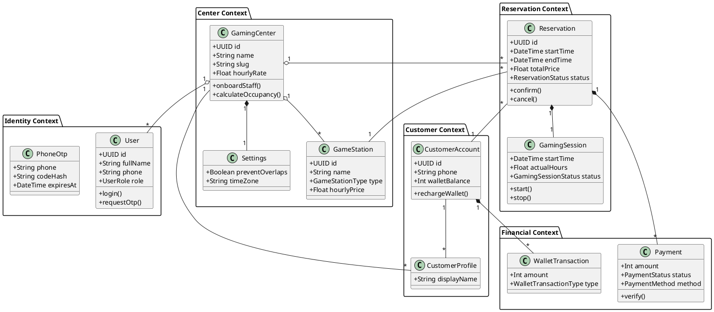

# Playenest Class Diagram Model

This document provides a comprehensive UML Class Model for the Playenest platform.

---

## TASK 1 – Identify Domain Classes

| Class ID | Class Name | Description | Business Purpose | Classification |
| :--- | :--- | :--- | :--- | :--- |
| **CL-001** | GamingCenter | Represents a physical gaming center location (tenant). | Central entity for managing a specific location's data. | Aggregate Root |
| **CL-002** | Settings | Configuration settings for a GamingCenter. | Controls business rules like overlap prevention and booking hours. | Entity |
| **CL-003** | User | Staff member or manager associated with a center. | Authenticated actor who performs administrative or operational tasks. | Aggregate Root |
| **CL-004** | CustomerAccount | Global identity for a gamer across the platform. | Tracks global wallet balance and identity. | Aggregate Root |
| **CL-005** | CustomerProfile | A customer's profile specific to a gaming center. | Stores per-center notes and relationship with the center. | Entity |
| **CL-006** | GameStation | A hardware unit (PC, Console, etc.) available for rent. | The primary resource being booked and monetized. | Entity |
| **CL-007** | Reservation | A commitment to use a station at a specific time. | Core transaction representing the booking contract. | Aggregate Root |
| **CL-008** | GamingSession | The live execution of a reservation. | Tracks actual usage time and active state of a station. | Entity |
| **CL-009** | Payment | A financial transaction for a reservation or wallet. | Records the movement of money through various methods. | Entity |
| **CL-010** | WalletTransaction| A record of credit or debit to a customer's wallet. | Audit trail for virtual currency movements. | Value Object |
| **CL-011** | StaffShift | Scheduled working hours for a staff member. | Manages operational availability of personnel. | Entity |
| **CL-012** | Page | A CMS web page for the center's public site. | Enables marketing and online presence. | Entity |
| **CL-013** | PageSection | A component of a CMS page. | Allows modular building of web pages. | Entity |
| **CL-014** | Media | Uploaded assets (images/videos). | Visual content for the site and stations. | Entity |
| **CL-015** | SiteSettings | Global look and feel/SEO for the center's site. | Manages SEO and branding. | Entity |
| **CL-016** | CommissionPolicy| Rules for platform fee calculation. | Defines the business relationship between platform and tenant. | Entity |
| **CL-017** | Earning | Record of commission calculated for a reservation. | Tracks platform revenue. | Entity |
| **CL-018** | Rating | Customer feedback for a session/station/center. | Measures quality and customer satisfaction. | Entity |
| **CL-019** | AuditLog | Immutable record of system actions. | Ensures accountability and security. | Entity |
| **CL-020** | PhoneOtp | Temporary code for authentication. | Securely verifies identity via SMS/WhatsApp. | Entity |

---

## TASK 2 – Define Attributes

### Class: GamingCenter
*   **id** : CUID (Required: Yes)
*   **name** : String (Required: Yes)
*   **slug** : String (Required: Yes, Validation: Unique, URL-friendly)
*   **isActive** : Boolean (Required: Yes, Default: True)
*   **hourlyRate** : Float (Required: Yes)
*   **vipHourlyRate** : Float (Required: No)
*   **openingTime** : String (Required: No, Validation: HH:mm)
*   **closingTime** : String (Required: No, Validation: HH:mm)

### Class: User
*   **id** : CUID (Required: Yes)
*   **fullName** : String (Required: Yes)
*   **phone** : String (Required: Yes, Validation: Mobile format)
*   **role** : UserRole (Required: Yes, Default: STAFF)
*   **isActive** : Boolean (Required: Yes, Default: True)
*   **passwordHash** : String (Required: No)

### Class: CustomerAccount
*   **id** : CUID (Required: Yes)
*   **phone** : String (Required: Yes, Validation: Unique, Mobile format)
*   **fullName** : String (Required: No)
*   **walletBalance** : Int (Required: Yes, Default: 0, Validation: >= 0)

### Class: GameStation
*   **id** : CUID (Required: Yes)
*   **name** : String (Required: Yes)
*   **stationType** : GameStationType (Required: Yes, Default: PC)
*   **hourlyPrice** : Float (Required: Yes)
*   **isVip** : Boolean (Required: Yes, Default: False)
*   **isActive** : Boolean (Required: Yes, Default: True)

### Class: Reservation
*   **id** : CUID (Required: Yes)
*   **startTime** : DateTime (Required: Yes)
*   **endTime** : DateTime (Required: Yes)
*   **totalPrice** : Float (Required: Yes, Validation: > 0)
*   **status** : ReservationStatus (Required: Yes, Default: CONFIRMED)
*   **paymentState** : ReservationPaymentState (Required: Yes, Default: UNPAID)
*   **stationSnapshot** : Json (Required: Yes)

### Class: GamingSession
*   **id** : CUID (Required: Yes)
*   **startTime** : DateTime (Required: Yes)
*   **endTime** : DateTime (Required: No)
*   **actualHours** : Float (Required: Yes, Default: 0)
*   **status** : GamingSessionStatus (Required: Yes, Default: ACTIVE)
*   **pausedMinutes** : Int (Required: Yes, Default: 0)

### Class: Payment
*   **id** : CUID (Required: Yes)
*   **amount** : Int (Required: Yes, Validation: > 0)
*   **status** : PaymentStatus (Required: Yes, Default: INITIATED)
*   **method** : PaymentMethod (Required: Yes)
*   **provider** : PaymentProvider (Required: Yes)
*   **referenceCode** : String (Required: No)

---

## TASK 3 – Define Operations (Methods)

### Class: GamingCenter
*   **updateSettings()**: Updates operational rules for the center.
*   **getAnalytics(dateRange)**: Retrieves performance metrics.
*   **calculateOccupancy()**: Computes current usage rate.
*   **onboardStaff(data)**: Adds a new staff member to the center.

### Class: User (Staff)
*   **login(otp)**: Authenticates the user.
*   **requestOtp()**: Triggers an OTP code delivery.
*   **updateProfile()**: Modifies staff details.
*   **assignShift(day, start, end)**: Creates a new shift for the user.

### Class: CustomerAccount
*   **rechargeWallet(amount)**: Adds funds to the global wallet.
*   **deductFromWallet(amount)**: Withdraws funds for booking.
*   **getHistory()**: Returns reservation and transaction history.

### Class: Reservation
*   **confirm()**: Sets status to confirmed and blocks the station.
*   **cancel(reason)**: Voids the reservation and potentially issues a refund.
*   **markNoShow()**: Updates status if customer fails to arrive.
*   **calculateFinalPrice()**: Re-evaluates cost based on actual usage.
*   **takeSnapshot()**: Records the station configuration at the time of booking.

### Class: GamingSession
*   **start()**: Begins the timer and marks station as IN_USE.
*   **pause()**: Temporarily halts the session timer.
*   **resume()**: Restarts the timer after a pause.
*   **stop()**: Ends the session and triggers billing finalization.

### Class: Payment
*   **verify()**: Communicates with the gateway to confirm payment success.
*   **refund()**: Initiates a reversal of the transaction.
*   **fail(reason)**: Logs a failed payment attempt.
*   **processWebhook(payload)**: Handles asynchronous notifications from providers.

---

## TASK 4 & 5 – Identify Relationships & Multiplicity

### Association

**GamingCenter (1) ↔ (1) Settings**
*   Cardinality: 1 to 1
*   Reason: Every center must have exactly one configuration object.

**CustomerAccount (1) ↔ (*) CustomerProfile**
*   Cardinality: 1 to many
*   Reason: A global user can have profiles across multiple gaming centers.

**User (1) ↔ (*) StaffShift**
*   Cardinality: 1 to many
*   Reason: A staff member has multiple scheduled shifts.

**CustomerAccount (1) ↔ (*) Rating**
*   Cardinality: 1 to many
*   Reason: A customer can provide feedback for multiple sessions.

### Aggregation

**Whole: GamingCenter**
**Part: User, GameStation, Page, Media, SocialLink, Address**
*   Reason: These entities belong to a center but can exist independently in some system contexts (e.g., Media library).

### Composition

**Owner: GamingCenter**
**Owned: SiteSettings, CommissionPolicy**
*   Lifecycle Dependency: If a GamingCenter is deleted, its site settings and policy are deleted.

**Owner: Reservation**
**Owned: GamingSession, Payment, Earning, Rating**
*   Lifecycle Dependency: These entities are intrinsically linked to the reservation's lifecycle.

**Owner: Page**
**Owned: PageSection**
*   Lifecycle Dependency: Page sections cannot exist without a parent page.

**Owner: CustomerAccount**
**Owned: WalletTransaction**
*   Lifecycle Dependency: Wallet logs are part of the account's immutable history.

### Dependency

**Source: Reservation**
**Target: GameStation**
*   Reason: A reservation depends on a specific station's availability and pricing.

**Source: Payment**
**Target: Reservation**
*   Reason: A payment is created for a specific reservation.

### Inheritance (Enumeration as types)

**Parent: User**
**Child: Manager, Supervisor, Staff, Trainee**
*   Reason: Role-based specialization of permissions and responsibilities.

---

## TASK 6 – Aggregate & Domain Boundaries (DDD)

### Bounded Contexts

**1. Identity & Access Context**
*   User
*   PhoneOtp
*   Session

**2. Gaming Center Operations Context**
*   GamingCenter
*   Settings
*   GameStation
*   StaffShift
*   StaffStationSkill

**3. Reservation & Session Context**
*   Reservation
*   GamingSession
*   CustomerProfile
*   StationMaintenance

**4. Customer & Wallet Context**
*   CustomerAccount
*   WalletTransaction
*   Membership

**5. CMS & Marketing Context**
*   Page
*   PageSection
*   Media
*   SiteSettings
*   SocialLink
*   Address

**6. Financial & Revenue Context**
*   Payment
*   CommissionPolicy
*   Earning
*   EarningPayment

### Aggregate Roots

**Aggregate Root: GamingCenter**
*   Child Entities: Settings, GameStation, StaffShift, StaffStationSkill.
*   Business Rules: Every station must belong to a center. Shift roles must align with center operational needs.

**Aggregate Root: User**
*   Child Entities: (None - linked to shifts).
*   Business Rules: A user must be unique by phone within a gaming center.

**Aggregate Root: CustomerAccount**
*   Child Entities: WalletTransaction, CustomerProfile.
*   Business Rules: Wallet balance cannot be negative. Profile data is isolated per center.

**Aggregate Root: Reservation**
*   Child Entities: GamingSession, Payment, Earning, Rating.
*   Business Rules: A reservation must be paid to be confirmed (if online). A session cannot start without a valid reservation.

**Aggregate Root: Page**
*   Child Entities: PageSection.
*   Business Rules: Slugs must be unique per gaming center.

---

## TASK 7 – Enumeration Catalog

### User Management
*   **UserRole**: MANAGER, SUPERVISOR, STAFF, TRAINEE
*   **ShiftRole**: CASHIER, TECH_SUPPORT, CLEANER, HOST, SECURITY
*   **SkillLevel**: BASIC, INTERMEDIATE, EXPERT

### Reservations & Sessions
*   **ReservationStatus**: PENDING, CONFIRMED, IN_PROGRESS, COMPLETED, CANCELED, NO_SHOW
*   **ReservationSource**: ONLINE, WALK_IN, PHONE
*   **ReservationPaymentState**: UNPAID, PENDING, PARTIALLY_PAID, PAID, REFUNDED, OVERPAID, FAILED, CANCELED
*   **GamingSessionStatus**: ACTIVE, PAUSED, COMPLETED, INTERRUPTED, NO_SHOW
*   **GameStationType**: PC, PLAYSTATION, XBOX, SWITCH, VR

### Financials
*   **PaymentMethod**: CASH, CARD, ONLINE, GIFT_CARD, MEMBERSHIP
*   **PaymentStatus**: INITIATED, PENDING, PAID, FAILED, REFUNDED, VOID, CANCELED
*   **PaymentProvider**: MANUAL, STRIPE, ZARINPAL
*   **CommissionType**: PERCENT, FIXED
*   **CommissionStatus**: PENDING, ACCRUED, CHARGED, WAIVED, REFUNDED
*   **WalletTransactionType**: REFUND, RESERVATION_PAYMENT, DEPOSIT, MANUAL_ADJUSTMENT

### CMS & Site
*   **PageStatus**: DRAFT, PUBLISHED, ARCHIVED
*   **PageType**: HOME, ABOUT, SERVICES, GALLERY, TEAM, CONTACT, CUSTOM, TOURNAMENT, BLOG
*   **PageSectionType**: HERO, RICH_TEXT, HIGHLIGHTS, SERVICES_GRID, STAFF_GRID, GALLERY_GRID, TESTIMONIALS, CONTACT_CARD, MAP, FAQ, CTA
*   **MediaType**: IMAGE, VIDEO
*   **MediaPurpose**: COVER, GALLERY, STATION, LOGO
*   **LinkType**: INSTAGRAM, WHATSAPP, TELEGRAM, WEBSITE, PHONE, GOOGLE_MAP

---

## TASK 8 – Validation Rules

### GamingCenter
*   **slug**: Must be unique, lowercase, no spaces (Regex: `^[a-z0-9-]+$`).
*   **hourlyRate**: Must be a positive number.

### User
*   **phone**: Must be a valid mobile number (Regex: `^09\d{9}$` for Iran).
*   **fullName**: Minimum 3 characters.

### CustomerAccount
*   **walletBalance**: Cannot be less than zero.
*   **phone**: Unique across the entire platform.

### Reservation
*   **startTime**: Must be in the future (for online bookings).
*   **endTime**: Must be after `startTime`.
*   **totalPrice**: Must match the calculation of `stationPrice * duration` (minus discounts).

### GameStation
*   **name**: Unique within a gaming center.
*   **hourlyPrice**: Must be greater than or equal to 0.

### Page
*   **slug**: Unique per GamingCenter.

---

## TASK 9 – Database Mapping Draft

| Table Name | Primary Key | Foreign Keys | Unique Constraints | Indexes |
| :--- | :--- | :--- | :--- | :--- |
| **GamingCenter** | id | - | slug | slug |
| **Settings** | id | gamingCenterId | gamingCenterId | - |
| **User** | id | gamingCenterId | gamingCenterId + phone | phone, role, isActive |
| **CustomerAccount** | id | - | phone | phone |
| **CustomerProfile** | id | gamingCenterId, customerAccountId | gamingCenterId + customerAccountId | displayName |
| **GameStation** | id | gamingCenterId | - | gamingCenterId + isActive |
| **Reservation** | id | gamingCenterId, customerProfileId, stationId, staffId | - | startTime, status, paymentState |
| **GamingSession** | id | reservationId, stationId | - | status, startTime |
| **Payment** | id | gamingCenterId, reservationId | provider + providerPaymentId | status, paidAt |
| **WalletTransaction**| id | customerAccountId, reservationId | - | customerAccountId |
| **Page** | id | gamingCenterId | gamingCenterId + slug | slug, status, type |
| **Earning** | id | reservationId, gamingCenterId | reservationId | status, chargedAt |

---

## TASK 10 – UML Class Diagram Specification

### Core Entities
*   **GamingCenter**: id, name, slug, hourlyRate. Methods: onboardStaff(), calculateOccupancy().
*   **User**: id, fullName, phone, role. Methods: login(), requestOtp().
*   **Reservation**: id, startTime, endTime, totalPrice, status. Methods: confirm(), cancel().
*   **CustomerAccount**: id, phone, walletBalance. Methods: rechargeWallet().

### Relationships
*   **GamingCenter "1" -- "1" Settings**: Ownership
*   **GamingCenter "1" -- "*" GameStation**: Aggregation
*   **GamingCenter "1" -- "*" User**: Aggregation
*   **GamingCenter "1" -- "*" Reservation**: Aggregation
*   **CustomerAccount "1" -- "*" CustomerProfile**: Association
*   **CustomerAccount "1" -- "*" WalletTransaction**: Composition
*   **Reservation "1" -- "1" GamingSession**: Composition
*   **Reservation "1" -- "*" Payment**: Composition
*   **Reservation "*" -- "1" GameStation**: Association

---

## TASK 11 – PlantUML Class Diagram

---

## TASK 12 – SOLID & DDD Validation

### SOLID Principles Validation

*   **SRP (Single Responsibility Principle)**: Classes are focused on specific domain concepts (e.g., `Payment` handles only financial verification, `GamingSession` handles only the live timer).
*   **OCP (Open/Closed Principle)**: Use of Enums for `GameStationType` and `PaymentProvider` allows adding new types/providers without modifying core logic.
*   **LSP (Liskov Substitution Principle)**: Role-based logic is handled via the `User` aggregate, ensuring all staff types can be treated as `User` for authentication.
*   **ISP (Interface Segregation Principle)**: Bounded contexts ensure that the Reservation system doesn't need to know about CMS page sections.
*   **DIP (Dependency Inversion Principle)**: Domain services (implied) depend on abstractions like `PaymentProvider` rather than concrete implementations like `Zarinpal`.

### DDD Principles Validation

*   **Aggregate Boundaries**: Clearly defined. `GamingCenter` protects its stations and settings. `Reservation` encapsulates its sessions and payments.
*   **Domain Services**: Needed for complex logic like `BookingEngine` (overlap prevention) and `WalletService` (atomic balance updates).
*   **Entity Ownership**: Clear lifecycle management through composition (e.g., `Page` owns `PageSections`).

### UML Quality Checks
*   **Duplicate Classes**: None found.
*   **Missing Relationships**: Added relationship between `CustomerAccount` and `Reservation` to track global booking history.
*   **Anemic Domain Model**: Avoided by defining rich behaviors (methods) within entities rather than just having data holders.

### Recommendations
1.  **Domain Events**: Implement events like `ReservationConfirmed` or `SessionStarted` to decouple side effects (like sending SMS) from core business logic.
2.  **Concurrency Control**: Use optimistic locking (versioning) on the `WalletBalance` to prevent race conditions during high-frequency transactions.
3.  **Value Objects**: Consider making `Address` and `Money` (Amount + Currency) explicit value objects to improve type safety and reuse.

---
