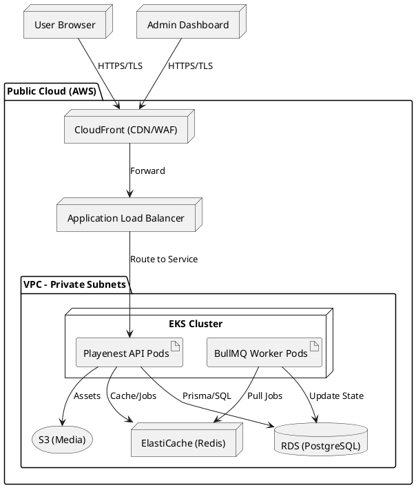

# Playenest Deployment & Infrastructure Architecture Model

This document defines the production-ready infrastructure and deployment architecture for the Playenest platform.

---

## TASK 1 – Deployment Strategy Selection

We have evaluated the following deployment models:

### Option A – Traditional Deployment (VM Based)
*   **Advantages:** Complete control over OS, easy to understand for legacy teams.
*   **Disadvantages:** Hard to scale quickly, manual configuration (drift), poor resource utilization.
*   **Operational Complexity:** High (Manual patching, scaling).
*   **Cost Impact:** Moderate (Fixed costs per VM).
*   **Recommendation:** Not recommended for modern scalable workloads.

### Option B – Containerized Deployment (Kubernetes)
*   **Advantages:** High scalability, self-healing, consistent environments, efficient resource usage.
*   **Disadvantages:** Steep learning curve, requires orchestration knowledge.
*   **Operational Complexity:** Moderate to High (Requires K8s expertise).
*   **Cost Impact:** Efficient (Pay for what you use, bin-packing).
*   **Recommendation:** **Selected.** Provides the best balance of scalability, resilience, and DevOps maturity.

### Option C – Serverless Deployment (FaaS)
*   **Advantages:** Zero infrastructure management, infinite scaling.
*   **Disadvantages:** Cold starts, vendor lock-in, hard to manage stateful apps like Gaming Sessions.
*   **Operational Complexity:** Low.
*   **Cost Impact:** High for constant workloads.
*   **Recommendation:** Not recommended for the core persistent backend.

**Final Recommendation:** **Option B (Containerized via Kubernetes)** for the Backend and Frontend, with Managed Services for PostgreSQL (RDS) and Redis (ElastiCache).

---

## TASK 2 – Environment Architecture

### 1. Development
*   **Purpose:** Local and cloud-based development for feature implementation.
*   **Resources:** Shared K8s Namespace, Docker Compose for local.
*   **Access Policy:** Full access for developers.

### 2. Test (QA/CI)
*   **Purpose:** Automated integration and E2E testing.
*   **Resources:** Ephemeral namespaces per PR.
*   **Access Policy:** Automated CI service accounts; Read-only for QA.

### 3. Staging
*   **Purpose:** Pre-production validation and UAT.
*   **Resources:** Mirror of Production (scaled down).
*   **Access Policy:** Restricted to DevOps and Leads.

### 4. Production
*   **Purpose:** Serving live traffic.
*   **Resources:** Multi-AZ EKS Cluster, Multi-AZ RDS.
*   **Access Policy:** Zero Trust; Break-glass access only via Bastion/IAM.

---

## TASK 3 – Infrastructure Components

| Node | Purpose | Dependencies | Network Zone |
| :--- | :--- | :--- | :--- |
| **Web Frontend** | Serving React/SPA assets. | API Gateway | Public (CDN) |
| **API Gateway** | Routing, Rate Limiting, SSL Termination. | Backend Services | Public |
| **Backend API** | Core business logic (Modular Monolith). | PostgreSQL, Redis | Private |
| **PostgreSQL** | Primary Relational Storage. | None | Private (Data) |
| **Redis Cluster** | Cache, Idempotency, BullMQ. | None | Private (Data) |
| **S3 Storage** | Media and document storage. | None | Private (Service) |
| **Monitoring Stack** | Metrics and Log collection. | All Nodes | Management |

---

## TASK 4 – Network Topology

### Public Zone (DMZ)
*   **AWS CloudFront (CDN):** Global content delivery and WAF protection.
*   **Application Load Balancer (ALB):** Distributing traffic to K8s Ingress.

### Private Zone (App)
*   **Kubernetes Worker Nodes:** Hosting the application pods.
*   **NAT Gateway:** For outbound traffic (SMS Gateway, Zarinpal).

### Private Zone (Data)
*   **Amazon RDS (PostgreSQL):** Isolated in data subnets with no public access.
*   **Amazon ElastiCache (Redis):** Cluster mode enabled.

### Management Zone
*   **VPN / Bastion Host:** Secure entry for administrative tasks.
*   **CI/CD Runners:** GitHub Actions runners for deployments.

**Communication Path:**
`User -> CloudFront -> ALB -> K8s Ingress -> API Pod -> [RDS / Redis]`

---

## TASK 5 – Deployment Mapping

| Software Component | Infrastructure Node |
| :--- | :--- |
| **React Frontend** | AWS S3 + CloudFront |
| **Express.js API** | EKS Cluster (Pods) |
| **Identity/Auth Service**| EKS Cluster (Pods) |
| **Reservation Engine** | EKS Cluster (Pods) |
| **PostgreSQL DB** | Amazon RDS (Multi-AZ) |
| **Redis Store** | Amazon ElastiCache |
| **BullMQ Workers** | EKS Cluster (Background Pods) |

---

## TASK 6 – High Availability Design

| Component | Redundancy Method | Recovery Process |
| :--- | :--- | :--- |
| **API Services** | Multi-AZ Deployment (Min 3 replicas) | Kubernetes self-healing (Liveness/Readiness). |
| **Database** | Multi-AZ Primary-Standby | RDS Automatic Failover (DNS swap) < 60s. |
| **Cache (Redis)** | Multi-AZ Replication Group | Automatic promotion of Replica to Primary. |
| **Network** | Multi-AZ VPC Design | AWS routing manages AZ outages. |

---

## TASK 7 – Disaster Recovery Design

### Backup Strategy
*   **DB:** Daily snapshots + Point-in-Time Recovery (PITR) for 35 days.
*   **Files:** S3 Versioning + Cross-Region Replication (CRR).
*   **Config:** Infrastructure as Code (Terraform) in Git.

### Recovery Objectives
*   **RPO (Recovery Point Objective):** 5 Minutes (Database PITR).
*   **RTO (Recovery Time Objective):** 1 Hour (Automated Terraform redeploy).

### Disaster Recovery Site
*   **Warm Site:** A scaled-down version of the infra in a secondary region (e.g., EU-Central vs EU-West).

---

## TASK 8 – Security Infrastructure

### Network Security
*   **WAF:** Protecting against OWASP Top 10.
*   **Security Groups:** Deny-all by default; only allow specific ports between tiers.
*   **mTLS:** Encrypted communication between internal services (optional for Phase 1).

### Access Control
*   **IAM Roles:** Pod-level permissions (IRSA) for S3/RDS access.
*   **RBAC:** K8s RBAC for cluster access.
*   **MFA:** Mandatory for all AWS Console and CLI access.

### Secret Management
*   **AWS Secrets Manager:** For DB credentials and JWT keys.
*   **External Secrets Operator:** Syncing AWS Secrets to K8s Secrets.

### Encryption
*   **At Rest:** AES-256 for RDS, S3, and EBS.
*   **In Transit:** TLS 1.3 for all public and internal (ALB to Pod) traffic.

---

## TASK 9 – Kubernetes Architecture

### Namespaces
*   `playenest-prod`: Production workloads.
*   `playenest-monitoring`: Prometheus/Grafana.
*   `playenest-infra`: Ingress, External Secrets.

### Deployment Specs
| Service | Replicas | Scaling Policy | Resource Limits |
| :--- | :--- | :--- | :--- |
| **api-server** | 3 - 10 | CPU > 60% | 512Mi RAM / 0.5 vCPU |
| **worker-nodes**| 2 - 5 | Memory > 70% | 1Gi RAM / 1.0 vCPU |

---

## TASK 10 – CI/CD Infrastructure

### Pipeline Stages (GitHub Actions)
1.  **Source:** Commit to `main`.
2.  **Build:** Docker Image Build & Push to Amazon ECR.
3.  **Test:** Unit & Integration tests in ephemeral DB.
4.  **Scan:** Snyk Security Scan for vulnerabilities.
5.  **Deploy (Staging):** `kubectl apply` to Staging namespace.
6.  **Approval:** Manual Gate for Production.
7.  **Deploy (Production):** Blue/Green deployment via ArgoCD.

---

## TASK 11 – Monitoring & Operations

### Observability Stack
*   **Metrics:** Prometheus + Grafana (Dashboarding).
*   **Logging:** Fluent-bit -> Amazon CloudWatch / ELK.
*   **Tracing:** OpenTelemetry -> Jaeger / Sentry.
*   **Alerting:** Alertmanager -> Slack / PagerDuty.

### Operational Dashboards
*   **System Health:** CPU/RAM/Disk of nodes and pods.
*   **API Performance:** Latency (P99), Error Rate (5xx), Request Count.
*   **Business Metrics:** Active Sessions, Success Payment Rate.

---

## TASK 12 – Capacity Planning

| Metric | Current (Est.) | 6-Month Projection | 12-Month Projection |
| :--- | :--- | :--- | :--- |
| **Active Users** | 1,000 | 10,000 | 50,000 |
| **Avg. RPS** | 5 | 50 | 250 |
| **Peak RPS** | 20 | 200 | 1,000 |
| **DB Storage** | 10 GB | 100 GB | 500 GB |

**Scaling Triggers:**
*   Horizontal Pod Autoscaler (HPA) triggers at 60% CPU utilization.
*   Cluster Autoscaler (CA) adds EC2 nodes when pods are unschedulable.

---

## TASK 13 – UML Deployment Specification

### Nodes
*   `<<device>> Client Browser`
*   `<<node>> AWS CloudFront (CDN)`
*   `<<node>> Application Load Balancer`
*   `<<node>> EKS Cluster (VPC Private Subnet)`
    *   `<<artifact>> API Server`
    *   `<<artifact>> Background Worker`
*   `<<database>> Amazon RDS (PostgreSQL)`
*   `<<node>> Amazon ElastiCache (Redis)`
*   `<<storage>> Amazon S3`

### Relationships
*   `Client Browser` --(HTTPS)--> `CloudFront`
*   `CloudFront` --(HTTPS)--> `Load Balancer`
*   `Load Balancer` --(TCP:3000)--> `API Server`
*   `API Server` --(SQL)--> `Amazon RDS`
*   `API Server` --(TCP:6379)--> `Amazon ElastiCache`
*   `API Server` --(HTTPS)--> `Amazon S3`

---

## TASK 14 – PlantUML Deployment Diagram

---

## TASK 15 – Infrastructure Review

### Review Findings
*   **Security:** Multi-tier isolation and WAF provide strong protection.
*   **Availability:** Multi-AZ setup eliminates single points of failure for compute and data.
*   **Scalability:** HPA and RDS scaling handle projected growth.
*   **Operational Complexity:** Kubernetes adds complexity but is mitigated by using Managed EKS.

### Identified Risks
1.  **Risk:** Single Region Deployment.
    *   *Mitigation:* Plan for Cross-Region DR (Task 7).
2.  **Risk:** Redis as a single point for jobs/sessions.
    *   *Mitigation:* Enable ElastiCache Multi-AZ with Auto-failover.

### Recommendations
1.  Implement **Infrastructure as Code (Terraform)** to ensure environment consistency.
2.  Enable **VPC Flow Logs** for network auditing.
3.  Use **Karpenter** for more efficient K8s node autoscaling compared to standard CA.

---
**Date:** 2023-10-27
**Status:** Production Ready
**Architects:** Enterprise Infrastructure Team
