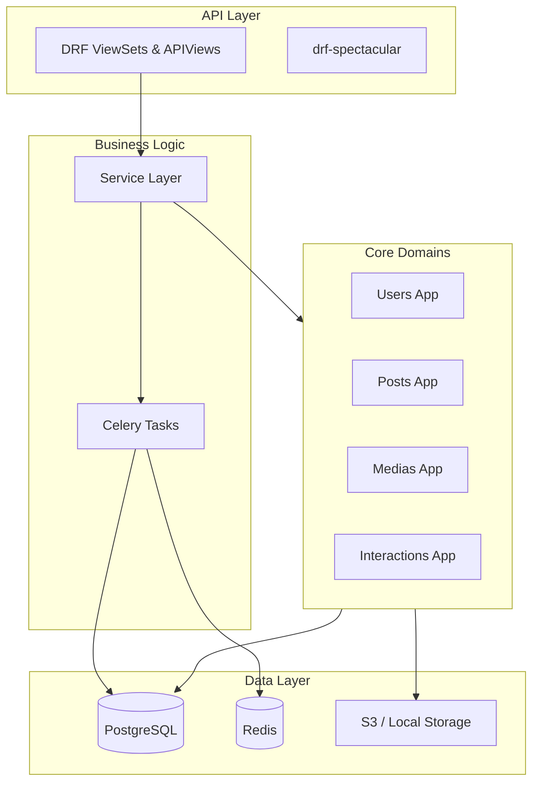

# Blog Platform — Enterprise-Grade Content Management System

## Project Overview
The **Blog Platform** is a production-ready, modular Django-based content management system designed for high-performance publishing workflows. It provides a robust backend for managing complex content lifecycles, user engagements, and centralized media assets with automated optimization.

### Purpose
To provide a scalable, secure, and developer-friendly foundation for modern blogs and news portals that require fine-grained access control, scheduled publishing, and rich media handling.

### Problem Solved
- **Content Lifecycle Management:** Handles the transition from draft to review, scheduled, and published states.
- **Media Inefficiency:** Automates image conversion to AVIF and video compression using FFmpeg to ensure fast load times.
- **Fragmented User Management:** Integrates standard JWT authentication with Google OAuth2 and Iranian-specific localized features (Jalali dates).
- **Scalability:** Built with a modular architecture that separates core concerns (Interactions, Navigation, Medias, Pages).

---

## Main Features

### 🔐 User & Identity Management
- **JWT Authentication:** Secure token-based access with refresh mechanisms.
- **Social Integration:** One-click login via Google OAuth2.
- **RBAC (Role-Based Access Control):** Predefined roles for Admins, Authors, and Users.
- **Profile Management:** Optimized profile pictures and biography tracking.

### ✍️ Advanced Publishing Engine
- **Rich Text Editing:** Integrated CKEditor 5 with image upload support.
- **Post Scheduling:** Automated publishing of scheduled content via Celery.
- **Versioning:** Historical revision tracking for all post edits.
- **Taxonomies:** Hierarchical categories, tags, and series management.

### 🖼️ Centralized Media Library
- **Automatic Optimization:** Real-time AVIF conversion and resizing for images.
- **Async Processing:** Background video optimization using FFmpeg.
- **Smart Linking:** Automatically syncs media attachments by parsing post content.

### 💬 Engagement & Interactions
- **Nested Comments:** Support for threaded discussions with moderation workflows.
- **Generic Reactions:** Extensible "Like" and Emoji system applicable to any content.

---

## Technology Stack

| Component | Technology |
| :--- | :--- |
| **Backend** | Django 5.0.6 (Python 3.12) |
| **API Framework** | Django REST Framework (DRF) |
| **Database** | PostgreSQL 14 |
| **Task Queue** | Celery + Redis |
| **Real-time** | Django Channels (ASGI) |
| **Reverse Proxy** | Nginx |
| **Containerization** | Docker + Docker Compose |
| **Admin UI** | Unfold (Modern Django Admin) |
| **Documentation** | drf-spectacular (OpenAPI 3.0) |

---

## Architecture Summary
The system follows a **Modular Monolith** architecture. Each domain (Users, Posts, Medias, etc.) is isolated into its own Django application with dedicated models, services, and APIs.



### Service Boundaries
- `users`: Identity, Authentication, and Permissions.
- `posts`: Content engine, Taxonomies, and Revisions.
- `medias`: Centralized asset storage and processing.
- `interactions`: Social features (Comments, Reactions).
- `navigation` & `pages`: CMS structural components.

---

## Quick Start

### Requirements
- Docker and Docker Compose
- Python 3.12+ (for local development)
- PostgreSQL & Redis (for local development)

### Docker Setup (Recommended)
1. **Clone & Configure:**
   ```bash
   cp .env.example .env
   # Edit .env with your credentials (ensure STATIC_API_KEY is set)
   ```
2. **Build & Launch:**
   ```bash
   docker-compose up --build
   ```
3. **Initialize:**
   ```bash
   docker-compose exec web python manage.py migrate
   docker-compose exec web python manage.py createsuperuser
   ```

### Local Installation
1. **Install Dependencies:**
   ```bash
   pip install -r requirements.txt
   ```
2. **Run Migrations:**
   ```bash
   python manage.py migrate
   ```
3. **Start Server:**
   ```bash
   python manage.py runserver
   ```

---

## API & Documentation
The API follows RESTful principles with standardized JSON responses:
```json
{
  "data": { ... },
  "messagesList": [],
  "pagination": { ... }
}
```

- **Swagger UI:** `/api/schema/swagger-ui/`
- **Redoc:** `/api/schema/redoc/`
- **OpenAPI Spec:** `/api/schema/`

---

## Testing
Run the full test suite (Unit + Integration):
```bash
python manage.py test
```
Target coverage: **95%+**
