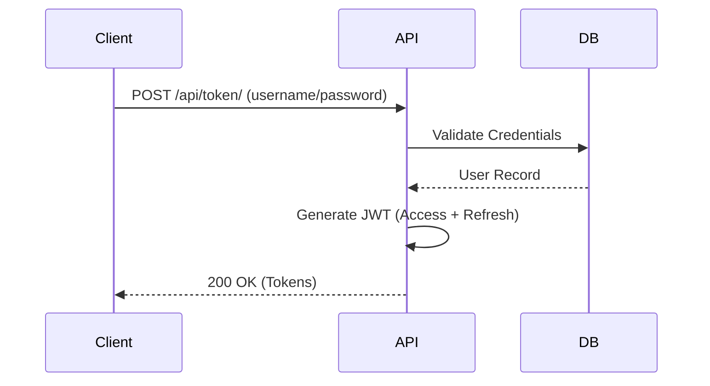
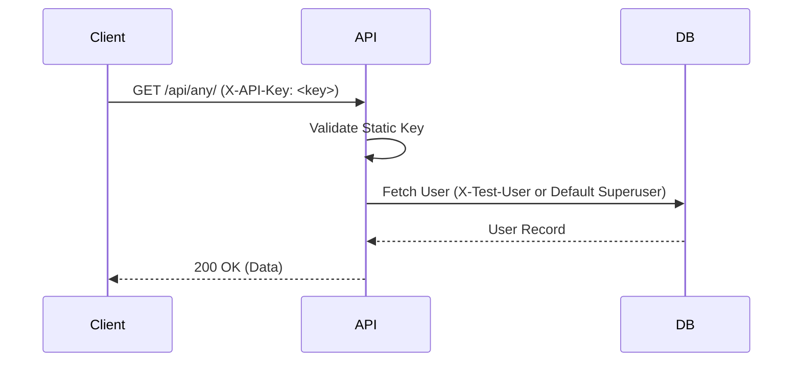

# Authentication & Authorization Documentation

This document explains the security model, authentication flows, and access control mechanisms used in the Blog Platform.

---

## Authentication Flow

### JWT (JSON Web Token)
The platform uses JWT for stateless authentication.
1. **Obtain Token:** Client sends credentials to `/api/token/` or `/api/auth/admin-login/`.
2. **Access & Refresh:** Server returns an `access` token (short-lived) and a `refresh` token (long-lived).
3. **Usage:** Client must include the access token in the `Authorization: Bearer <token>` header for all protected requests.
4. **Renewal:** When the access token expires, the client uses the `refresh` token at `/api/token/refresh/` to get a new access token.

### Static API Key
For development, automated testing, and internal service communication, a static API Key can be used.
1. **Usage:** Include the key in the `X-API-Key` header.
2. **User Simulation:** (Optional) Include a username in the `X-Test-User` header to act as that specific user.
3. **Fallback:** If `X-Test-User` is not provided, the system defaults to the first superuser found.

---

## Authorization Model

The system utilizes **RBAC (Role-Based Access Control)** supplemented by object-level checks.

### Predefined Roles
- **Admin (Staff):** Full access to the Admin Panel and all API endpoints. Can moderate comments and manage all posts.
- **Author:** Can create posts, manage their own posts, and view their own analytics. Access is granted if the user has an associated `AuthorProfile`.
- **User:** Authenticated users who can post comments and react to content.

### Permission Classes
| Class | Logic |
| :--- | :--- |
| `IsAdminUser` | `request.user.is_staff == True` |
| `IsOwnerOrAdmin` | `user == request.user` OR `user.is_staff == True` |
| `IsAuthorOrAdminOrReadOnly` | `request.method in SAFE` OR `user.is_staff` OR `has_author_profile` |

---

## Sequence Diagrams

### Login Flow (Standard)

### Static API Key Flow

---

## Security Protections
- **Brute Force:** Handled by `django-axes`. Multiple failed attempts result in a temporary lockout of the IP or Username.
- **CSRF:** Required for all session-based requests (Admin Panel). Not required for JWT Bearer auth.
- **CORS:** Whitelisted domains only (configured via `CORS_ALLOWED_ORIGINS`).
- **Secure Cookies:** In production, session and CSRF cookies are marked as `Secure` and `HttpOnly`.
