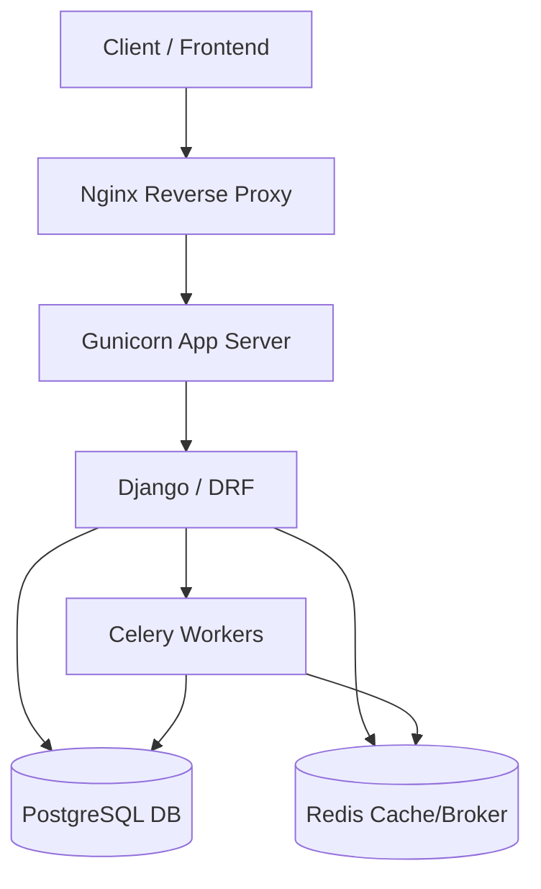
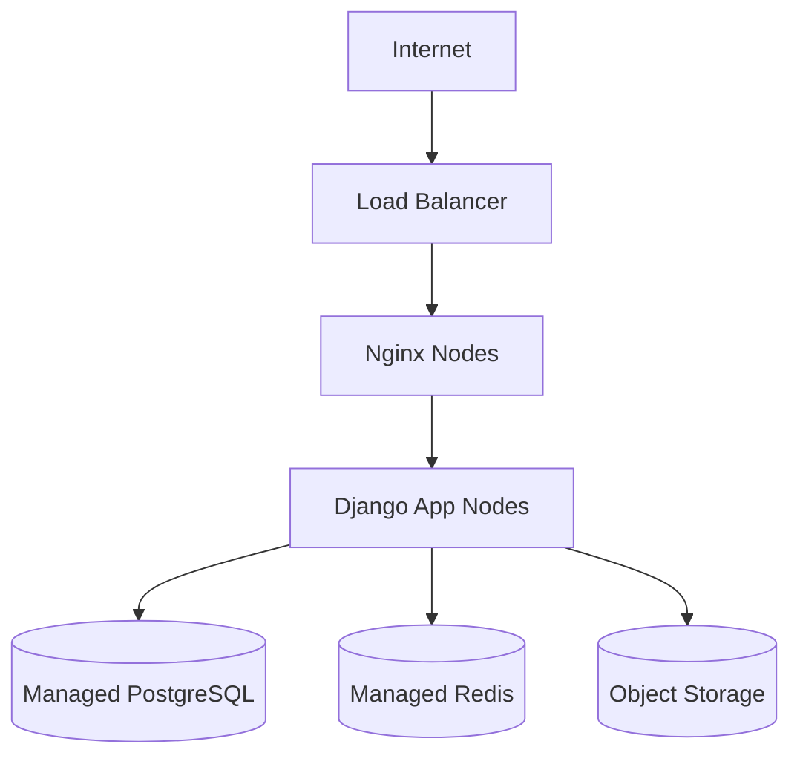

# ENTERPRISE DOCUMENTATION — PHASE 5

This document represents the authoritative system-level documentation for the Django/DRF backend system, consolidating business rules, security protocols, and architecture design.

---

# SECTION 1 — BUSINESS RULES DOCUMENTATION

## OBJECTIVE
Extract and formalize all domain/business rules from the system behavior.

## BUSINESS RULE TABLE

| Rule ID | Description | Scope | Enforcement Layer |
| :--- | :--- | :--- | :--- |
| **BR-001** | **Single Author Profile**: A user can have exactly one Author Profile. | Users | Model (`OneToOneField`) |
| **BR-002** | **Automated Reading Time**: Post reading time is calculated based on content word count (200 wpm). | Posts | Model (`save` method) |
| **BR-003** | **Media Synchronization**: Media attachments (cover, OG, in-content) must sync with post content. | Posts/Medias | Service (`sync_post_media`) |
| **BR-004** | **Scheduled Publishing**: Scheduled posts are published automatically via background workers. | Posts | Service + Celery Beat |
| **BR-005** | **Race-Condition Protection**: View counts must use atomic increments to ensure data integrity. | Posts | Service (`F()` expressions) |
| **BR-006** | **Media Validation**: Files are restricted to 10MB and specific allowed extensions (.jpg, .mp4, etc). | Medias | Serializer + Validator |
| **BR-007** | **Author Notifications**: Post authors must be notified of new comments asynchronously. | Interactions | Service + Celery |
| **BR-008** | **Reaction Toggling**: Reaction actions toggle state (Create if absent, Delete if present). | Interactions | Service (`toggle_reaction`) |
| **BR-009** | **Reaction Uniqueness**: A user cannot have multiple identical reactions on the same object. | Interactions | DB Constraint (`unique_together`) |
| **BR-010** | **Cache Consistency**: User dashboard caches must be cleared upon profile updates or deletion. | System | Signals (`post_save`, `post_delete`) |

---

# SECTION 2 — PERMISSION MATRIX

## OBJECTIVE
Define Role-Based Access Control (RBAC) across system operations based on active Permission Classes.

## PERMISSION MATRIX

| Role | Create | Read | Update | Delete | Manage System |
| :--- | :---: | :---: | :---: | :---: | :---: |
| **Admin (Staff)** | ✅ | ✅ | ✅ | ✅ | ✅ |
| **Author** | ✅ (Posts/Media) | ✅ | ✅ (Own) | ✅ (Own) | ❌ |
| **User (Auth)** | ✅ (Comments) | ✅ | ✅ (Own) | ✅ (Own) | ❌ |
| **Guest** | ❌ | ✅ | ❌ | ❌ | ❌ |
| **System** | Auto | Auto | Auto | Auto | ❌ |

## NOTES
* **IsAuthorOrAdminOrReadOnly**: Applied to Posts; requires AuthorProfile for write access.
* **IsOwnerOrAdmin**: Applied to Medias, Comments, and AuthorProfiles; checks `user`, `author`, or `uploaded_by`.
* **IsAdminUserOrReadOnly**: Applied to Categories, Tags, and Series; restricted to Staff for modifications.
* **Standard Response**: All permission denials return a standardized error format via `StandardResponseRenderer`.

---

# SECTION 3 — SYSTEM DESIGN DOCUMENT (SDD)

## 1. SYSTEM OVERVIEW
The system is a modular monolith designed for a high-performance blog platform, utilizing Django and DRF for the core API, PostgreSQL for persistence, and Redis for caching and task brokerage.

## 2. SYSTEM GOALS
* Provide a robust and scalable CMS backend.
* Ensure data integrity through a strictly enforced Service Layer.
* Maintain high availability via asynchronous background processing.
* Deliver standardized, version-ready API responses.

## 3. ARCHITECTURE OVERVIEW

## 4. DATA ARCHITECTURE
* **Relational Model**: PostgreSQL 14+ handles all core entities.
* **Content Types**: Used for generic relations (Reactions).
* **Optimization**: `select_related` and `prefetch_related` are used in custom Managers to solve N+1 problems.
* **Historical Tracking**: `Revision` model stores snapshots of post content.

## 5. API ARCHITECTURE
* **Framework**: Django REST Framework (DRF).
* **Auth**: Stateless JWT (JSON Web Tokens).
* **Standardization**: Custom Renderers ensure all responses follow the `{"data": ..., "messagesList": ...}` structure.
* **Documentation**: OpenAPI 3.0 specs generated automatically.

## 6. SECURITY ARCHITECTURE
* **JWT Authentication**: Bearer tokens for API access.
* **RBAC**: Multi-layered permission classes.
* **Validation**: Strict serializer-level validation and custom validators for file uploads and financial strings (SHEBA).
* **Protection**: `django-axes` for brute-force protection and Nginx-level request limiting.

## 7. BUSINESS LOGIC ARCHITECTURE
* **Service Layer**: Decouples logic from Views/Models into `services.py`.
* **Side Effects**: Managed via Celery tasks to prevent blocking the request-response cycle.
* **Integrity**: Transactions and F() expressions ensure consistency during concurrent updates.

## 8. DEPLOYMENT ARCHITECTURE

## 9. SCALING STRATEGY
* **Horizontal**: Stateless App Nodes and independent Celery Workers allow scaling based on load.
* **Caching**: Redis caches frequently accessed detail views and user-specific dashboards.
* **Queuing**: Celery queues are prioritized (`high`, `default`, `low`) to ensure critical tasks like auth emails are never delayed by media processing.

## 10. MONITORING & OBSERVABILITY
* **Logging**: Structured logging with severity levels (INFO, ERROR).
* **Tracing**: Request-ID propagation (if middleware enabled).
* **Error Tracking**: Integration-ready for Sentry.

## 11. DATABASE DESIGN SUMMARY
* Normalized schema with foreign key integrity.
* Through-models for Many-to-Many relations (e.g., `PostTag`).
* Optimized indexes on `slug` and `status` fields.

## 12. SYSTEM SECURITY SUMMARY
* HTTPS/TLS termination at Nginx.
* CORS policies enforced via `django-cors-headers`.
* CSRF protection for session-based Admin access.

## 13. FINAL ARCHITECTURE SUMMARY
The platform is built as a Modular Monolith with clear domain boundaries, ready for future decomposition into microservices if necessary. It leverages industry-standard patterns for performance, security, and maintainability.
