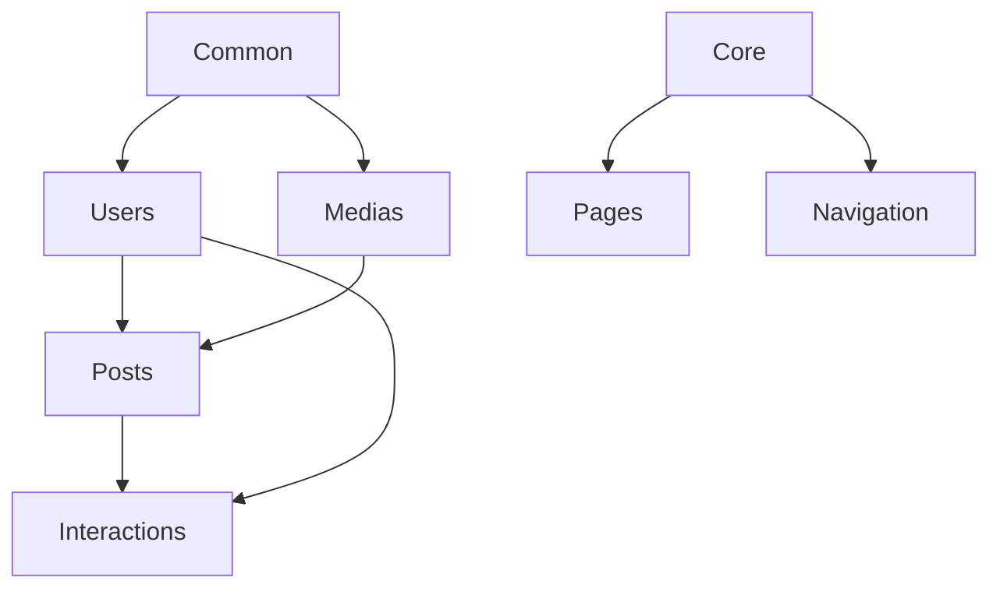

# Project Structure Documentation

The Blog Platform follows a modular Django architecture, where each application represents a specific business domain.

---

## Repository Tree

```text
.
├── blog/                   # Core Project Configuration
│   ├── settings.py         # Global settings
│   ├── urls.py             # Root URL routing
│   ├── celery.py           # Celery app initialization
│   └── wsgi.py / asgi.py   # Web server interfaces
├── common/                 # Shared Infrastructure & Utilities
│   ├── renderers.py        # Standardized API response formatting
│   ├── schema.py           # Custom OpenAPI schema generation
│   ├── optimization.py    # Image/Video processing logic
│   └── permissions.py      # Global reusable permissions
├── core/                   # Base Domain Logic
│   └── base_models.py      # Abstract BaseModel (timestamps, is_active)
├── users/                  # Identity & Access Management
│   ├── models.py           # Custom User model
│   ├── auth_utils.py       # Security helpers (axes lockout logic)
│   └── services.py         # Auth business logic
├── posts/                  # Content Management (The Core)
│   ├── models.py           # Posts, Categories, Tags, Series, Revisions
│   ├── tasks.py            # Scheduled publishing
│   └── services.py         # Content sync and analytics
├── medias/                 # Centralized Asset Library
│   ├── models.py           # Media metadata storage
│   └── services.py         # Upload and optimization handling
├── interactions/           # Engagement Features
│   ├── models.py           # Comments and Generic Reactions
│   └── tasks.py            # Notification triggers
├── pages/                  # Static Content Management
├── navigation/            # Dynamic Menu Management
├── nginx/                  # Reverse Proxy Configuration
├── mock-server/            # Node.js Mock API for frontend development
├── tests/                  # Integration Test Suite
└── staticfiles/            # Collected static files (Internal)
```

---

## Application Overview

| App | Responsibility | Models | APIs | Dependencies |
| :--- | :--- | :--- | :--- | :--- |
| **users** | Identity & Auth | `User` | Register, Me, Login, Google Login | `common` |
| **posts** | Content Engine | `Post`, `Category`, `Tag`, `Series`, `Revision` | CRUD, Publish, Similar Posts | `users`, `medias`, `core` |
| **medias** | Asset Library | `Media`, `PostMedia` | Upload, Download | `users`, `common` |
| **interactions** | Social Features | `Comment`, `Reaction` | Post Comments, Like/Emoji | `users`, `posts` |
| **pages** | Static Pages | `Page` | CRUD Static Content | `core` |
| **navigation** | Site Menus | `Menu`, `MenuItem` | CRUD Dynamic Menus | `core` |
| **common** | Shared Logic | - | - | - |
| **core** | Base Architecture| - | - | - |

---

## Dependency Analysis

The project is designed to minimize circular dependencies by utilizing a service layer and generic relationships where appropriate.

### Core Relationships
1. **Content → Media:** `Post` and `AuthorProfile` depend on `medias.Media` for attachments and avatars.
2. **Engagement → Content:** `interactions.Comment` relates directly to `posts.Post`.
3. **Reactions → Generic:** `interactions.Reaction` uses a Generic Foreign Key, allowing it to attach to any model without a hard dependency.
4. **All → Core:** Every model inherits from `core.base_models.BaseModel`.



---

## Shared Components
- **`common.renderers.StandardResponseRenderer`:** Ensures all API responses are wrapped in a `{data, messagesList, pagination}` envelope.
- **`common.fields.OptimizedImageField`:** A legacy field for image management (optimization disabled).
- **`core.base_models.BaseModel`:** Provides `created_at`, `updated_at`, and `is_active` fields for consistent auditing across all tables.
