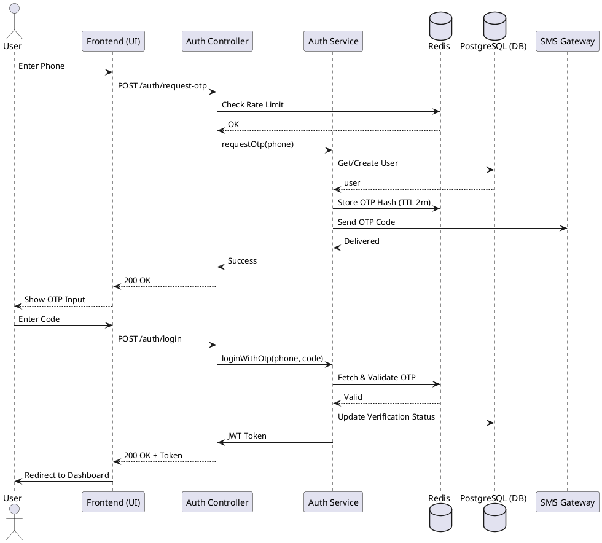
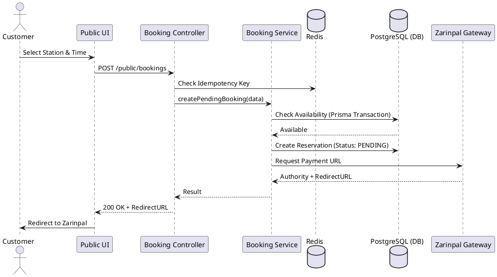
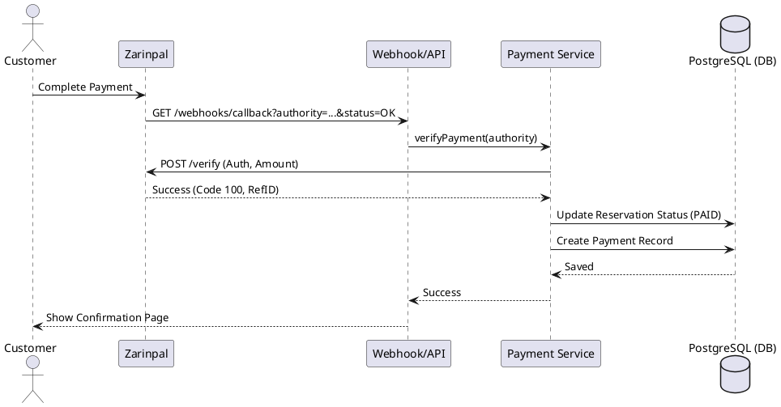
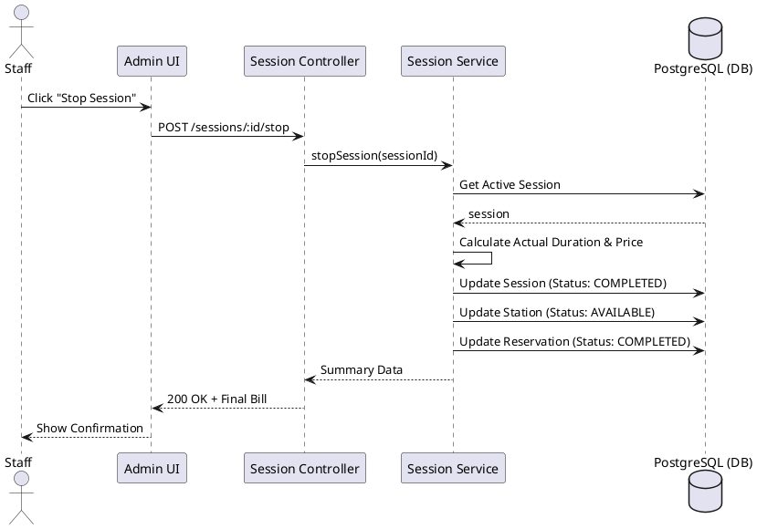

# Playnest Sequence Diagram Specifications

This document defines the interaction and message flow models for the Playnest platform using UML 2.x standards.

---

## TASK 1 – Sequence Diagram Candidate List

| Sequence ID | Use Case | Priority | Complexity | Actors Involved | Classification |
| :--- | :--- | :--- | :--- | :--- | :--- |
| **SEQ-001** | UC-001, UC-002 | High | Medium | User, SMS Gateway | Critical Interaction |
| **SEQ-002** | UC-004, UC-016 | High | High | Customer, Zarinpal | Critical Interaction |
| **SEQ-003** | UC-005, UC-006 | High | Medium | Staff | Core Interaction |
| **SEQ-004** | UC-008 | High | Medium | Staff | Core Interaction |
| **SEQ-005** | UC-016 | High | Medium | Customer, Zarinpal | Critical Interaction |
| **SEQ-006** | UC-015, UC-017 | Medium | Medium | Customer, Manager | Supporting Interaction |
| **SEQ-007** | UC-010 | High | Low | Manager | Core Interaction |
| **SEQ-008** | UC-012 | High | Low | Manager | Core Interaction |
| **SEQ-009** | UC-011 | Medium | Low | Manager | Supporting Interaction |
| **SEQ-010** | UC-004, UC-005 | High | Medium | Customer, Staff | Core Interaction |

---

## TASK 2 – Lifeline Definitions

| Sequence | Lifelines |
| :--- | :--- |
| **General** | Actor, UI (Frontend), API (Controller), Service, Redis, DB (Prisma), External |
| **Auth** | User, UI, AuthAPI, AuthService, Redis, DB, SMSGateway |
| **Booking** | Customer, UI, BookingAPI, BookingService, Redis, DB, Zarinpal |
| **Session** | Staff, UI, SessionAPI, SessionService, DB |
| **Payment** | Customer, UI, PaymentAPI, PaymentService, Redis, DB, Zarinpal |

---

## TASK 3 – Message Flow Specifications

### SEQ-001: User Authentication (OTP)
1. **Actor → UI:** Enter Phone Number
2. **UI → API:** POST /auth/otp/request
3. **API → Redis:** Rate Limit Check
4. **API → Service:** requestOtp(phone)
5. **Service → DB:** Find/Create User
6. **Service → Redis:** Store OTP Hash (2m expiry)
7. **Service → External:** SMS Gateway: Send Code
8. **External → Actor:** SMS with Code
9. **Actor → UI:** Enter Code
10. **UI → API:** POST /auth/otp/verify
11. **API → Service:** verifyOtp(phone, code)
12. **Service → Redis:** Get OTP Hash & Validate
13. **Service → DB:** Update PhoneVerifiedAt
14. **Service → API:** JWT Token
15. **API → UI:** 200 OK + Token

### SEQ-002: Online Station Booking
1. **Customer → UI:** Select Station Type & Time
2. **UI → API:** POST /public/bookings
3. **API → Redis:** Idempotency Check
4. **API → Service:** createPendingBooking(data)
5. **Service → DB:** Start Transaction: Check Availability
6. **Service → DB:** Create Reservation (Status: PENDING)
7. **Service → External:** Zarinpal: Request Payment URL
8. **External → Service:** Authority + URL
9. **Service → API:** Redirect URL
10. **API → UI:** 200 OK + URL
11. **UI → Customer:** Redirect to Gateway

### SEQ-003: Walk-in Booking & Session Start
1. **Staff → UI:** Select Station & Customer Phone
2. **UI → API:** POST /bookings/walk-in
3. **API → Service:** createWalkinAndStart(data)
4. **Service → DB:** Create Reservation (Status: CONFIRMED)
5. **Service → DB:** Create GamingSession (Status: ACTIVE)
6. **Service → DB:** Update GameStation (Status: IN_USE)
7. **Service → API:** Session Details
8. **API → UI:** 201 Created

### SEQ-004: Stop Session (Check-out)
1. **Staff → UI:** Stop Session
2. **UI → API:** POST /sessions/:id/stop
3. **API → Service:** stopSession(sessionId)
4. **Service → DB:** Update GamingSession (Status: COMPLETED)
5. **Service → DB:** Update GameStation (Status: AVAILABLE)
6. **Service → Service:** Calculate Final Cost
7. **Service → DB:** Update Reservation (Status: COMPLETED)
8. **Service → API:** Final Bill
9. **API → UI:** 200 OK

### SEQ-005: Payment Verification
1. **External → API:** GET /webhooks/zarinpal?authority=...&status=OK
2. **API → Service:** handleCallback(authority)
3. **Service → External:** Zarinpal: Verify Payment
4. **External → Service:** RefID + Code: 100
5. **Service → DB:** Update Reservation (Status: PAID)
6. **Service → API:** Success
7. **API → UI:** Show "Payment Successful"

### SEQ-006: Wallet Recharge
1. **Customer → UI:** Input Amount
2. **UI → API:** POST /wallet/recharge
3. **API → Service:** initiateRecharge(amount)
4. **Service → External:** Zarinpal: Get Payment URL
5. **External → Service:** Authority + URL
6. **Service → API:** URL
7. **API → UI:** Redirect

### SEQ-007: Configure Center
1. **Manager → UI:** Edit Settings
2. **UI → API:** PATCH /gamingCenters/:id
3. **API → Service:** updateCenter(id, data)
4. **Service → DB:** `prisma.gamingCenter.update()`
5. **DB → Service:** Updated Record
6. **Service → API:** Success
7. **API → UI:** 200 OK

### SEQ-008: Manage Station
1. **Manager → UI:** Create Station
2. **UI → API:** POST /stations
3. **API → Service:** createStation(data)
4. **Service → DB:** `prisma.gameStation.create()`
5. **Service → API:** Record
6. **API → UI:** 201 Created

### SEQ-009: Manage Staff Shifts
1. **Manager → UI:** Assign Shift
2. **UI → API:** POST /shifts
3. **API → Service:** assignShift(data)
4. **Service → DB:** `prisma.staffShift.create()`
5. **Service → API:** Record
6. **API → UI:** 201 Created

### SEQ-010: Monitor Occupancy
1. **Staff → UI:** Open Dashboard
2. **UI → API:** GET /stations/status
3. **API → DB:** Query GameStation where active=true
4. **DB → API:** List of Stations + Active Sessions
5. **API → UI:** JSON Data
6. **UI → Staff:** Display Grid

---

## TASK 4 – Authentication & Authorization Flows

### JWT Validation & RBAC
1. **UI → API:** Request with Bearer Token
2. **API → Middleware:** authGuard
3. **Middleware → Redis:** Check Token Revocation
4. **Middleware → Service:** Verify JWT Signature
5. **Middleware → DB:** Fetch User Role & Permissions
6. **Middleware → API:** Inject `req.actor`
7. **API → Controller:** Handle Request

---

## TASK 5 – CRUD Interaction Sequences

### Entity: GamingCenter
- **Create:** Admin → UI → API → Service → DB (Create tenant)
- **Read:** Actor → UI → API → Service → DB (Fetch by Slug/ID)
- **Update:** Manager → UI → API → Service → DB (Update configuration)
- **Delete:** Admin → UI → API → Service → DB (Mark isActive=false)

### Entity: GameStation
- **Create:** Manager → UI → API → Service → DB (Add hardware)
- **Read:** Staff → UI → API → Service → DB (List center stations)
- **Update:** Manager → UI → API → Service → DB (Edit rate/type)
- **Delete:** Manager → UI → API → Service → DB (Remove unit)

### Entity: Reservation
- **Create:** Customer → UI → API → Service → DB (Hold slot + Transaction)
- **Read:** Actor → UI → API → Service → DB (Fetch detail/history)
- **Update:** Staff → UI → API → Service → DB (Modify time/status)
- **Delete:** Manager → UI → API → Service → DB (Cancel & Refund)

---

## TASK 6 – Exception Handling Sequences

| Exception ID | Trigger | System Reaction | User Feedback |
| :--- | :--- | :--- | :--- |
| **EX-001** | Invalid OTP | Code mismatch in Redis | "Invalid code. Please try again." |
| **EX-002** | Expired OTP | Key not found in Redis | "OTP expired. Request a new one." |
| **EX-003** | Rate Limit | >5 requests/min in Redis | "Too many requests. Try later." |
| **EX-004** | Payment Fail | Zarinpal status != 100 | "Payment failed. Please retry." |
| **EX-005** | Unauthorized | Missing/Invalid JWT | Redirect to Login |
| **EX-006** | Conflict | Station already booked | "Selected slot is no longer available." |

---

## TASK 7 – External System Integration

### SMS Gateway (OTP Delivery)
1. **Service → Gateway:** API Call (Phone, Template, Code)
2. **Gateway → Service:** Success/Error Result
3. **Service → Service:** Log Attempt count
4. **Service → Service:** If fail, throw 503 Service Unavailable

### Zarinpal (Verification)
1. **Service → Zarinpal:** Verify Request (Authority, Amount)
2. **Zarinpal → Service:** Response (Status: 100 or 101)
3. **Service → Service:** If status == 100, finalize entity
4. **Service → Service:** If fail, mark transaction as FAILED

---

## TASK 8 – UML Text Specifications

**User Login:**
User → UI: Enter Phone
UI → AuthAPI: POST /otp/request
AuthAPI → AuthService: generateOtp()
AuthService → Redis: SET otp:{phone} {hash} EX 120
AuthService → SMS: send(phone, code)
User → UI: Enter Code
UI → AuthAPI: POST /otp/verify
AuthAPI → AuthService: validate(phone, code)
AuthService → Redis: GET otp:{phone}
AuthService → API: JWT
API → UI: 200 OK

---

## TASK 9 – PlantUML Sequence Diagrams

### SEQ-001: Authentication (OTP Request & Verify)

### SEQ-002: Online Station Booking (Public)

### SEQ-005: Payment Verification Flow

### SEQ-004: Session Stop & Finalization

---

## TASK 10 – Validation & Optimization Report

### Validation Summary
- **Continuity:** All flows from User input to DB persistence are mapped.
- **Security:** Auth and RBAC are integrated into the message flows via middleware lifelines.
- **Error Handling:** Explicit Redis and Service-level validations prevent corrupt states.
- **DB Interaction:** Explicit `prisma` calls modeled in every state-changing sequence.

### Optimization Suggestions
1.  **Reduce Latency:** Implement WebSocket for live station status updates instead of polling API in `Monitor Occupancy`.
2.  **Concurrency:** Use Redis-based distributed locks for high-traffic station bookings to avoid Prisma transaction deadlocks under heavy load.
3.  **Caching:** Cache Gaming Center configuration and public pages in Redis to reduce DB load for anonymous traffic.
4.  **Async Processing:** Move SMS notification and Analytics summary updates to background workers (BullMQ) to keep response times < 200ms.
