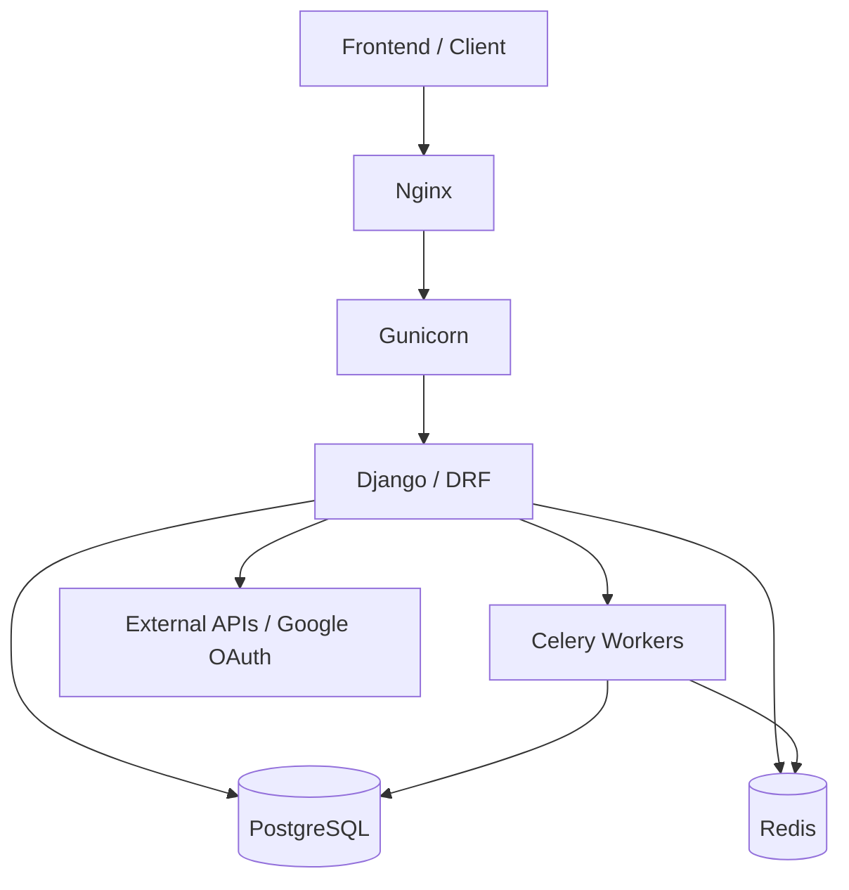
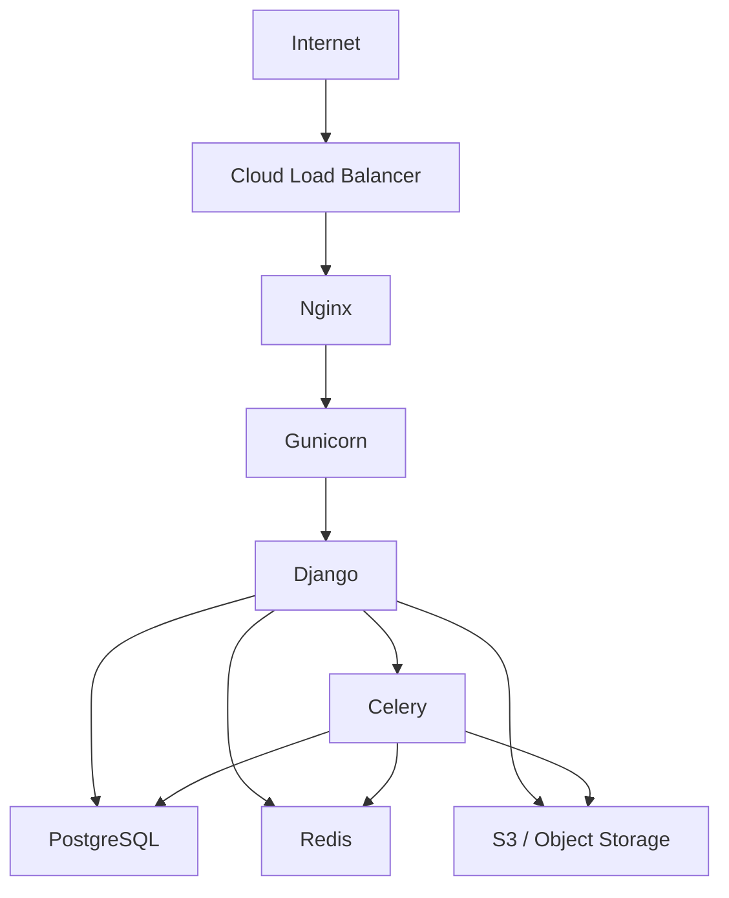
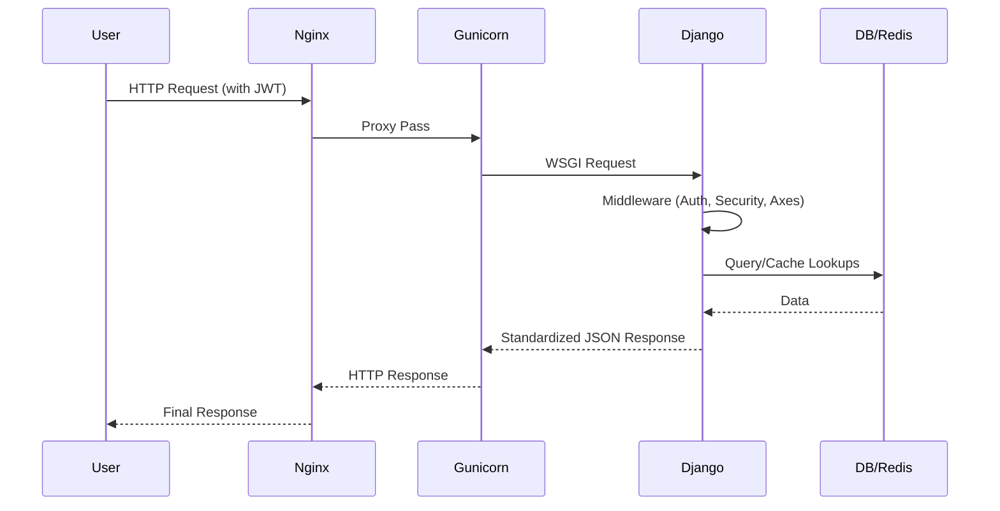
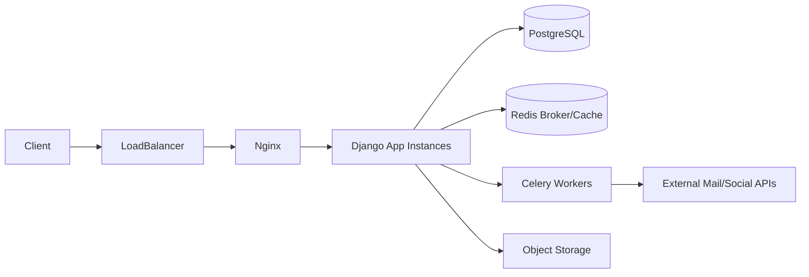

# Phase 4: System Architecture & Deployment Design

## Section 1 — System Architecture Diagram

### Modern Full Stack Architecture (Production Setup)

---

## Section 2 — Component Breakdown

### Client Layer
*   **Consumers**: Web applications, mobile apps, and administrative users.
*   **Interactions**: Consumes RESTful APIs using JWT for authentication.

### Reverse Proxy (Nginx)
*   **Responsibilities**:
    *   SSL/TLS termination (HTTPS).
    *   Routing requests to the application server (Gunicorn).
    *   Serving static files from `staticfiles/` and media files from `media/`.
    *   Enforcing request size limits (e.g., `client_max_body_size 100M`).

### Application Server (Gunicorn)
*   **Responsibilities**:
    *   WSGI server managing multiple worker processes.
    *   Bridging HTTP requests from Nginx to the Django application.

### Backend (Django / DRF)
*   **Responsibilities**:
    *   **API Layer**: RESTful endpoints with standardized responses.
    *   **Business Logic**: Encapsulated in the Service Layer (e.g., `sync_post_media`, `publish_scheduled_posts`).
    *   **Auth**: JWT authentication and Role-Based Access Control (RBAC).
    *   **ORM**: abstraction for PostgreSQL interaction.

### Database (PostgreSQL)
*   **Responsibilities**:
    *   Persistent storage for users, posts, comments, media metadata, etc.
    *   Relational integrity and complex querying (e.g., F() expressions for view counts).

### Cache Layer (Redis)
*   **Responsibilities**:
    *   **Cache**: Caching frequently accessed data (e.g., user dashboards).
    *   **Broker**: Message broker for Celery tasks.
    *   **Channel Layer**: Backend for real-time features (Django Channels).

### Background Workers (Celery)
*   **Responsibilities**:
    *   **Async Tasks**: Media processing (AVIF conversion), notification sending.
    *   **Periodic Tasks**: Celery Beat handles scheduled post publication every minute.

---

## Section 3 — Deployment Architecture (Production)

### Standard Production Flow

### Components in Production
*   **Load Balancer**: Distributes traffic across multiple Nginx/App instances.
*   **PostgreSQL Cluster**: Primary-replica setup for high availability and backups.
*   **Redis Cluster**: Scalable cache and broker layer.
*   **S3 / Object Storage**: Durable storage for media assets (configured via `django-storages`).

---

## Section 4 — Request Flow Analysis

### API Request Lifecycle

---

## Section 5 — Scalability Architecture

### Scaling Strategy
*   **Horizontal Scaling**: Application instances (Gunicorn) and Celery workers can be scaled independently based on CPU/Memory usage.
*   **Database Scaling**: Offloading read-heavy operations to PostgreSQL replicas.
*   **Async Processing**: Celery task queues are partitioned (`high_priority`, `default`, `low_priority`) to prevent congestion of critical tasks.
*   **Cache**: Redis-based caching reduces DB load for frequently requested data like post details.

---

## Section 6 — Security Architecture

### Security Boundaries
*   **Network**: HTTPS termination at Nginx.
*   **Authentication**: Stateless JWT-based authentication for APIs; Session-based for Admin.
*   **Authorization**: Permission checks at the DRF level (e.g., `IsOwnerOrAdmin`) and Object-level permissions via `django-guardian`.
*   **Brute-Force Protection**: `django-axes` monitors and blocks suspicious login attempts.
*   **Data Integrity**: Serializer-level validation and ORM-protected SQL queries.

---

## Section 7 — Infrastructure Components

| Component | Purpose | Technical Detail |
| :--- | :--- | :--- |
| **Nginx** | Reverse proxy & Static server | Version 1.25+ |
| **Gunicorn** | WSGI Application Server | sync/eventlet workers |
| **Django** | Backend API Framework | DRF 3.15+ |
| **PostgreSQL** | Primary Database | Version 14+ |
| **Redis** | Cache & Task Broker | Version 8.2-alpine |
| **Celery** | Distributed Task Queue | Async/Periodic jobs |
| **S3/MinIO** | Object Storage | Media & private assets |

---

## Section 8 — Environment Models

### Development
*   Local Django server (`manage.py runserver`).
*   Local SQLite or Docker-based PostgreSQL.
*   `DEBUG=True` with `Silk` profiling enabled.

### Staging
*   Production-identical Docker environment.
*   Pre-production data for integration testing.
*   CI/CD pipeline target for validation.

### Production
*   Multi-instance deployment with Load Balancer.
*   Managed Database (RDS) and Redis (ElastiCache).
*   S3 for media storage.
*   Monitoring and Error tracking (Sentry).

---

## Section 9 — Key Architecture Patterns

### Used Patterns
*   **Modular Monolith**: Organized into independent apps (`users`, `posts`, `medias`, `interactions`, etc.).
*   **Service Layer Pattern**: Business logic decoupled from views into `services.py`.
*   **Event-driven Architecture**: Decoupled side effects (e.g., media sync, notifications) using Celery.
*   **Standardized API**: Consistent response format across all endpoints via custom renderers.

### System Type
*   **Modular Monolith**: The architecture is designed to be "microservice-ready" by maintaining strict domain boundaries, but currently deployed as a single unit for simplicity.

---

## Section 10 — Bottleneck Analysis

### Potential Risks
*   **N+1 Queries**: Risk in listing endpoints (mitigated by `select_related` and `prefetch_related` in `PostManager`).
*   **Heavy Parsing**: Synchronous HTML parsing for media synchronization on post save.
*   **Queue Congestion**: Large volumes of image optimizations could delay high-priority tasks (mitigated by priority-based queues).
*   **Redis Memory**: High cache usage without proper eviction policies.

---

## Section 11 — Infrastructure Diagram Summary

