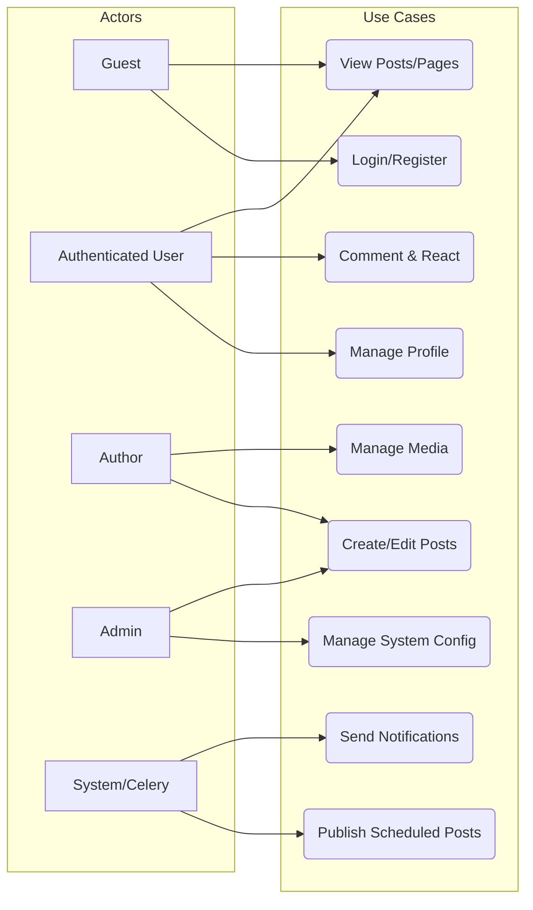
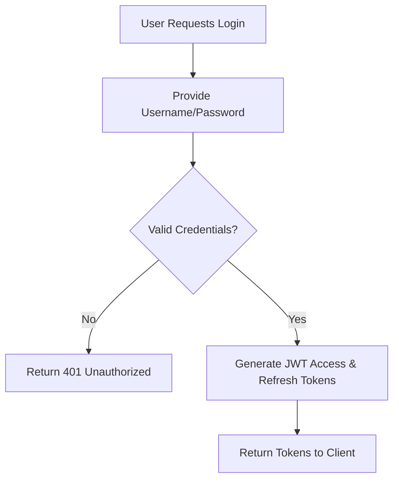
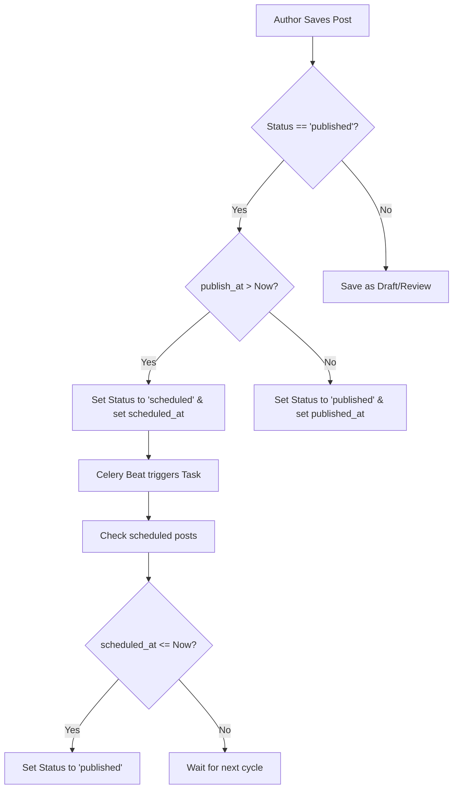
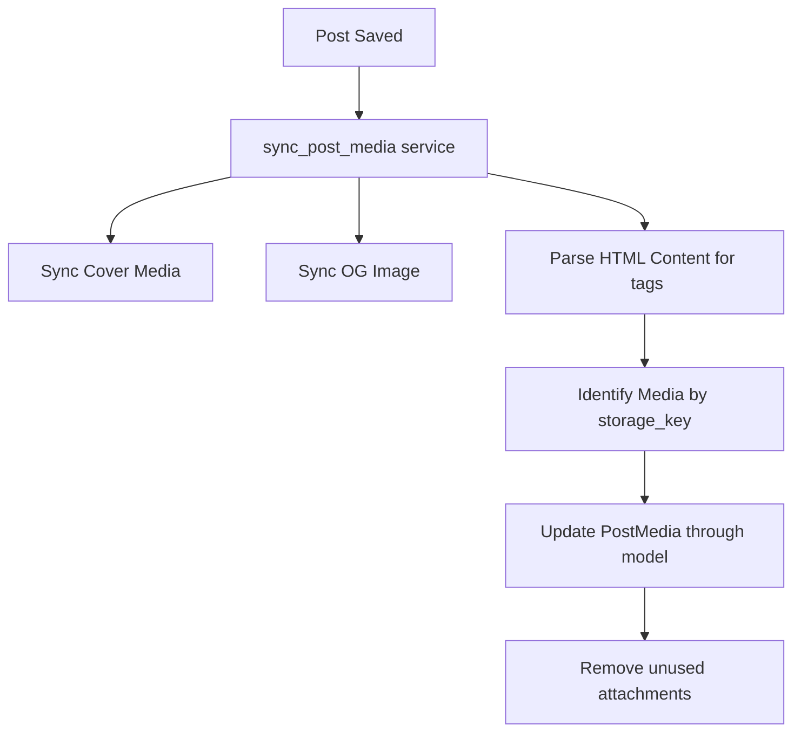
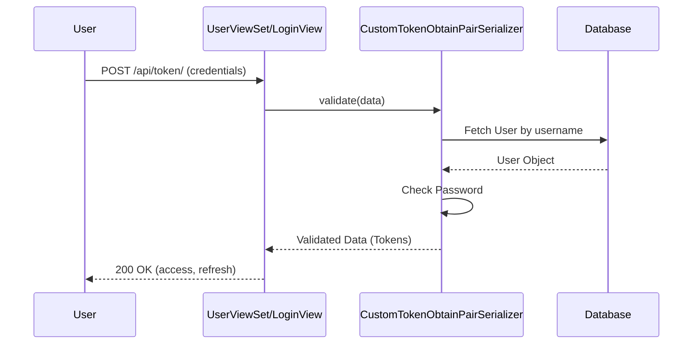
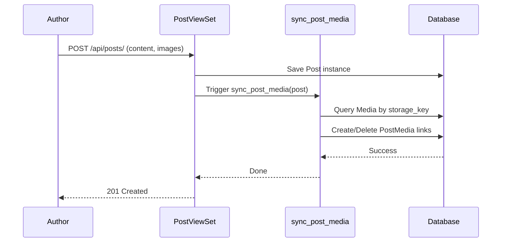
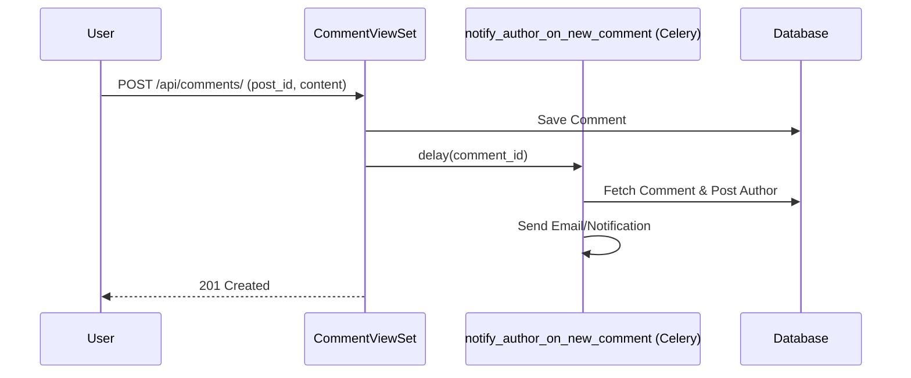
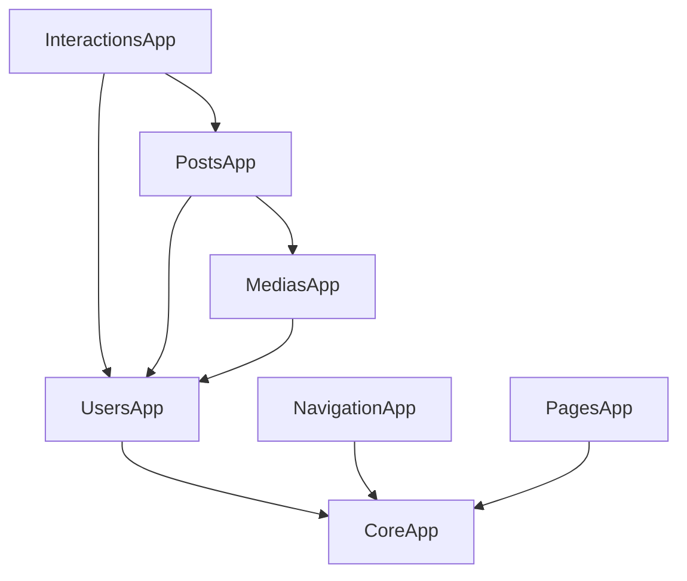

# Phase 3: System Analysis & Design Documentation

## Introduction
This document provides a comprehensive overview of the Blog Platform's system design, reverse-engineered from the Django/DRF implementation. It includes structural, functional, and behavioral models using UML standards.

---

## Section 1: Class Diagram

### Core Models & Relationships
The system follows a modular architecture with clear domain boundaries. All models inherit from a common `BaseModel`.

```mermaid
classDiagram
    class BaseModel {
        <<abstract>>
        +bool is_active
        +datetime created_at
        +datetime updated_at
    }

    subgraph UsersDomain ["Users Domain"]
        class User {
            +string username
            +string email
            +string password
            +file profile_picture
            +list role()
        }
    end

    subgraph PostsDomain ["Posts Domain"]
        class AuthorProfile {
            +string display_name
            +text bio
        }
        class Category {
            +string slug
            +string name
            +text description
            +int order
        }
        class Tag {
            +string slug
            +string name
        }
        class Series {
            +string slug
            +string title
            +string order_strategy
        }
        class Post {
            +string slug
            +string title
            +text excerpt
            +text content
            +string status
            +string visibility
            +datetime published_at
            +datetime scheduled_at
            +int views_count
        }
        class Revision {
            +string title
            +text content
            +string change_note
        }
    end

    subgraph MediasDomain ["Medias Domain"]
        class Media {
            +string storage_key
            +url url
            +string type
            +string mime
            +int size_bytes
        }
        class PostMedia {
            +string attachment_type
        }
    end

    subgraph InteractionsDomain ["Interactions Domain"]
        class Comment {
            +text content
            +string status
            +ip ip
        }
        class Reaction {
            +string reaction
            +int object_id
        }
    end

    subgraph PagesDomain ["Pages Domain"]
        class Page {
            +string slug
            +string title
            +text content
            +string status
        }
    end

    subgraph NavigationDomain ["Navigation Domain"]
        class Menu {
            +string name
            +string location
        }
        class MenuItem {
            +string label
            +string url
            +int order
        }
    end

    BaseModel <|-- User
    BaseModel <|-- AuthorProfile
    BaseModel <|-- Category
    BaseModel <|-- Tag
    BaseModel <|-- Series
    BaseModel <|-- Post
    BaseModel <|-- Revision
    BaseModel <|-- Media
    BaseModel <|-- PostMedia
    BaseModel <|-- Comment
    BaseModel <|-- Reaction
    BaseModel <|-- Page
    BaseModel <|-- Menu
    BaseModel <|-- MenuItem

    User "1" -- "1" AuthorProfile : owns
    AuthorProfile "1" -- "*" Post : writes
    Category "1" -- "*" Post : classifies
    Category "0..1" -- "*" Category : parent
    Post "*" -- "*" Tag : tagged with (PostTag)
    Series "1" -- "*" Post : grouped in
    Post "1" -- "*" Revision : has
    Post "1" -- "*" PostMedia : contains
    Media "1" -- "*" PostMedia : attached to
    Post "1" -- "*" Comment : commented on
    Comment "1" -- "*" Comment : replies to
    User "1" -- "*" Comment : writes
    User "1" -- "*" Reaction : performs
    Reaction "*" -- "1" Post : reacts to (Generic)
    Reaction "*" -- "1" Comment : reacts to (Generic)
    Menu "1" -- "*" MenuItem : contains
    MenuItem "0..1" -- "*" MenuItem : parent
    AuthorProfile "*" -- "0..1" Media : avatar
    Post "*" -- "0..1" Media : cover_media
    Post "*" -- "0..1" Media : og_image
```

---

## Section 2: Use Case Diagram

### System Actors
- **Guest**: Unauthenticated visitor.
- **Authenticated User**: Logged-in user.
- **Author**: User with profile and publishing rights.
- **Admin/Staff**: System administrator.
- **System (Celery)**: Background worker for scheduled tasks and notifications.



---

## Section 3: Activity Diagrams

### 1. Login Flow


### 2. Post Publication/Scheduling Flow


### 3. Media Synchronization Flow


---

## Section 4: Sequence Diagrams

### 1. JWT Login Sequence


### 2. Post Creation with Media Sync


### 3. Comment Creation with Notification


---

## Section 5: Domain Design Overview

The system is organized into distinct domains to ensure high cohesion and low coupling.

### Domain Boundaries
1.  **Users**: Authentication (JWT, Google OAuth2), Profile Management, Authorization (RBAC).
2.  **Posts**: Content creation, versioning (Revisions), Categories, Tags, Series, and Scheduling.
3.  **Medias**: File storage (Local/S3), Media metadata, Post-Media associations, and Image optimization.
4.  **Interactions**: User engagement via Comments and Reactions (Generic relationships).
5.  **Navigation**: Dynamic Menu management.
6.  **Pages**: Static content management.

### Data Flow Architecture
- **API Layer**: DRF ViewSets handle HTTP requests and enforce permissions.
- **Service Layer**: Encapsulates business logic (e.g., `sync_post_media`, `create_comment`) to keep views thin.
- **Task Layer**: Celery handles asynchronous and periodic tasks (Notifications, Scheduling).
- **Persistence Layer**: PostgreSQL (primary) and Redis (caching/queues).

---

## Section 6: Dependency Architecture

### Dependency Graph


### Architecture Insights
- **Standardized Response**: All API responses follow a uniform JSON structure via `StandardResponseRenderer` and `StandardizedAutoSchema`.
- **Generic Relationships**: Reactions use Django's ContentTypes system to allow reacting to any model.
- **Mixins for Reusability**: `BaseModel` provides common fields; `FileChangeDetectionMixin` and `DynamicFieldsMixin` enhance functionality.
- **Tight Coupling**: `Posts` and `Medias` are relatively tightly coupled due to the `sync_post_media` logic.

---

## Section 7: Architecture Insights

### Design Patterns
- **Service Layer Pattern**: Business logic is decoupled from views into standalone service functions.
- **Observer Pattern**: Implemented via Django Signals and Celery tasks for side effects (e.g., notifications).
- **Strategy Pattern**: Used in `Series` for ordering (Manual vs. By Date).
- **Adapter Pattern**: Used in `Media` storage to support both Local and S3 backends.

### System Type
**Modular Monolith**: The system is built as a single Django project but strictly organized into independent apps with defined interfaces.

### Scalability Analysis
- **Bottlenecks**: Heavy HTML parsing in `sync_post_media` for large posts.
- **DB Hotspots**: `Reactions` and `Comments` tables under high engagement.
- **Optimization**: Redis is utilized for caching and as a broker for distributed task execution.

### Security Model
- **Authentication**: JWT-based (stateless) with Google OAuth2 support.
- **Authorization**: DRF Permission classes + Django Guardian for object-level permissions.
- **Protection**: Django Axes for brute-force protection; security headers (HSTS, XSS) enabled.
