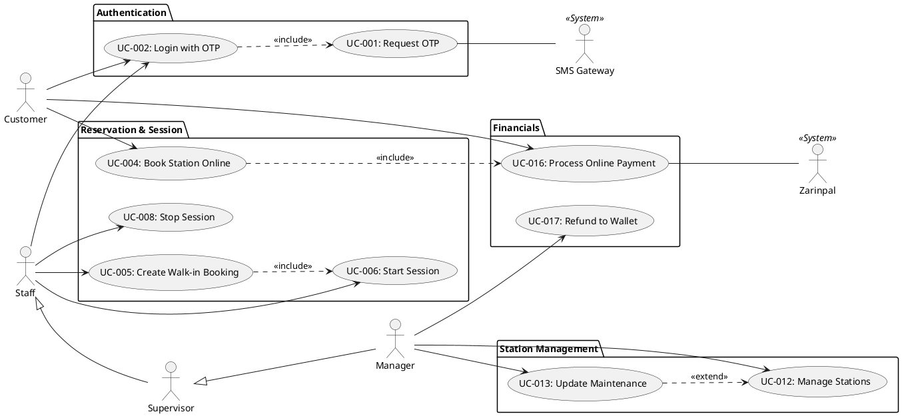

# Playnest Use Case Model

This document provides a comprehensive UML Use Case Model for the Playnest platform, based on the Requirements Analysis, PRD, and Frontend Requirements.

---

## 1. Actor Catalog (TASK 1)

### ACT-001: Gaming Center Manager
*   **Description:** The primary owner or administrator of a specific gaming center.
*   **Responsibilities:** Business operations, financial oversight, staff management, center configuration.
*   **Access Level:** Full administrative access (MANAGER role) restricted to their own tenant.
*   **Goals:** Maximize profit, optimize occupancy, monitor staff performance, ensure system accuracy.

### ACT-002: Gamer (Customer)
*   **Description:** An end-user who visits the center or uses the online platform to book stations.
*   **Responsibilities:** Managing their own reservations, maintaining wallet balance.
*   **Access Level:** CUSTOMER account access.
*   **Goals:** Easy and quick booking, transparent pricing, rewards, seamless gaming experience.

### ACT-003: Receptionist / Staff
*   **Description:** Front-desk personnel handling daily operations and walk-in customers.
*   **Responsibilities:** Handling check-ins/outs, managing live sessions, assisting customers.
*   **Access Level:** STAFF role.
*   **Goals:** Smooth daily operations, accurate session tracking, high customer satisfaction.

### ACT-004: Supervisor
*   **Description:** Shift lead responsible for overseeing staff and handling escalations.
*   **Responsibilities:** Staff scheduling, viewing reports, adjusting shifts.
*   **Access Level:** SUPERVISOR role.
*   **Goals:** Efficient shift management, conflict resolution.

### ACT-005: Trainee
*   **Description:** New staff members in training.
*   **Responsibilities:** Learning the system, assisting staff under supervision.
*   **Access Level:** TRAINEE role (Read-only access).
*   **Goals:** Learning platform workflows without risking data integrity.

### ACT-006: Platform Admin
*   **Description:** System-wide administrator for the entire multi-tenant platform.
*   **Responsibilities:** Tenant onboarding, global system maintenance, monitoring logs.
*   **Access Level:** SUPER_ADMIN.
*   **Goals:** Platform stability, growth, and security across all tenants.

### ACT-007: Zarinpal (External System)
*   **Description:** The external payment gateway used for processing transactions.
*   **Responsibilities:** Validating payments, sending webhook notifications.
*   **Access Level:** API-based integration.
*   **Goals:** Secure and reliable payment processing.

---

## 2. Use Case Catalog (TASK 2)

| ID | Name | Goal | Primary Actor | Trigger | Priority |
| :--- | :--- | :--- | :--- | :--- | :--- |
| **UC-001** | Request Auth OTP | Receive a login code via SMS. | All Users | Entering phone on login page | High |
| **UC-002** | Login with OTP | Authenticate into the system. | All Users | Submitting OTP code | High |
| **UC-003** | Logout | Terminate session. | All Users | Clicking logout | High |
| **UC-004** | Book Station Online | Reserve station for future use. | Customer | Browsing public site | High |
| **UC-005** | Create Walk-in Booking | Immediate reservation at center. | Staff | Customer arrival | High |
| **UC-006** | Start Gaming Session | Activate a reservation. | Staff | Customer ready to play | High |
| **UC-007** | Pause/Resume Session | Temporarily stop timer. | Staff | Customer request | Medium |
| **UC-008** | Stop Session (Check-out) | Complete gaming and finalize. | Staff | Play time end | High |
| **UC-009** | Change Station | Move user to another station. | Staff | Hardware issue/Request | Medium |
| **UC-010** | Configure Center | Set name, slug, and rates. | Manager | Business setup | High |
| **UC-011** | Manage Staff Shifts | Schedule staff working hours. | Manager | Operations planning | Medium |
| **UC-012** | Manage Stations | CRUD for hardware units. | Manager | Inventory update | High |
| **UC-013** | Update Maintenance | Mark station as out of order. | Manager | Hardware failure | High |
| **UC-014** | Monitor Occupancy | View live station status. | Staff | Ongoing management | High |
| **UC-015** | Charge Wallet | Add credit to account. | Customer | Need for funds | High |
| **UC-016** | Process Payment | Settle booking cost via gateway. | Customer | Finalizing booking | High |
| **UC-017** | Refund to Wallet | Credit back cancelled booking. | Manager | Cancellation/Error | High |
| **UC-018** | Calculate Commissions | Determine platform fee. | System | Payment completion | Medium |
| **UC-019** | Create Custom Page | Publish new CMS content. | Manager | Marketing requirement | Medium |
| **UC-020** | Manage Media | Upload images for gallery. | Manager | Site update | Medium |
| **UC-021** | Configure SEO | Set meta tags for pages. | Manager | SEO optimization | Medium |
| **UC-022** | View Revenue Report | Analyze earnings. | Manager | Financial review | High |
| **UC-023** | View Occupancy Stats | Analyze station usage. | Manager | Performance review | Medium |
| **UC-024** | View Staff Report | Analyze staff performance. | Manager | Operations review | Medium |

---

## 3. Actor-Use Case Matrix (TASK 3)

| Actor | Auth (UC1-3) | Booking (UC4-5) | Sessions (UC6-9) | Admin (UC10-14) | Finance (UC15-18) | CMS (UC19-21) | Reports (UC22-24) |
| :--- | :---: | :---: | :---: | :---: | :---: | :---: | :---: |
| **Manager** | X | X | X | X | X | X | X |
| **Customer** | X | X | | | X | | |
| **Staff** | X | X | X | X (Read) | | | |
| **Supervisor**| X | X | X | X (Read) | X (Refund) | | X |
| **Trainee** | X | | (Read) | (Read) | | | |

---

## 4. Use Case Relationships (TASK 4)

### Include Relationships
*   **UC-004 (Book Online) includes UC-016 (Process Online Payment)**
    *   *Reason:* Online bookings require payment to be confirmed according to business rules.
*   **UC-005 (Create Walk-in) includes UC-006 (Start Session)**
    *   *Reason:* Walk-in bookings are intended for immediate play.
*   **UC-002 (Login) includes UC-001 (Request OTP)**
    *   *Reason:* Login process mandates a valid OTP which must be requested first.

### Extend Relationships
*   **UC-017 (Refund to Wallet) extends UC-008 (Stop Session / Cancel)**
    *   *Condition:* If the booking is cancelled within the allowed time frame (BR-005).
*   **UC-013 (Update Maintenance) extends UC-012 (Manage Stations)**
    *   *Condition:* When a station is marked as "Out of Order".

### Generalization Relationships
*   **Parent Actor:** Staff
*   **Child Actor:** Supervisor
    *   *Reason:* Supervisor inherits all staff capabilities but has additional reporting and management permissions.

---

## 5. Module Classification (TASK 5)

### Authentication Module
*   UC-001: Request OTP
*   UC-002: Login with OTP
*   UC-003: Logout

### Gaming Center Module
*   UC-010: Configure Center Settings
*   UC-011: Manage Staff Shifts

### Station Management Module
*   UC-012: Create/Update/Delete Station
*   UC-013: Update Maintenance Status
*   UC-014: Monitor Live Occupancy

### Reservation & Session Module
*   UC-004: Online Booking
*   UC-005: Walk-in Booking
*   UC-006: Start Session
*   UC-007: Pause/Resume Session
*   UC-008: Stop Session (Check-out)
*   UC-009: Change Station (In-session)

### CMS & Marketing Module
*   UC-019: Create Custom Page
*   UC-020: Manage Media Gallery
*   UC-021: Configure SEO Metadata

### Financial & Wallet Module
*   UC-015: Charge Wallet
*   UC-016: Process Online Payment
*   UC-017: Refund to Wallet
*   UC-018: Calculate Commissions

### Reporting & Analytics Module
*   UC-022: Daily Revenue Report
*   UC-023: Occupancy Analytics
*   UC-024: Staff Performance Report

---

## 6. Fully Dressed Use Case Specifications (TASK 6)

### Use Case ID: UC-002
**Use Case Name:** Login with OTP

**Goal:** Securely authenticate any user into the platform.

**Primary Actor:** All Users

**Supporting Actors:** SMS Gateway (for UC-001)

**Preconditions:**
1. User has a valid mobile number registered or wants to register.

**Postconditions:**
1. User is issued a JWT (JSON Web Token).
2. User profile/session is established.

**Main Success Scenario:**
1. User enters phone number on login screen.
2. System triggers UC-001 (Request OTP).
3. User receives 6-digit code via SMS.
4. User enters code into the system.
5. System validates code against stored OTP and expiration.
6. System identifies User Role (Manager, Staff, or Customer).
7. System redirects user to appropriate dashboard.

**Exception Flows:**
*   **E1: Invalid OTP:** If code doesn't match, system returns 401 Unauthorized.
*   **E2: Expired OTP:** If code is older than 2 minutes, system requires a new request.

---

### Use Case ID: UC-004
**Use Case Name:** Book a Station Online

**Goal:** Allow a customer to reserve a gaming station through the public website.

**Primary Actor:** Customer

**Supporting Actors:** Zarinpal (Payment Gateway)

**Preconditions:**
1. Customer has access to the gaming center's public slug.
2. Stations are defined and have available slots.

**Postconditions:**
1. Reservation is created in 'PENDING' or 'CONFIRMED' status.
2. Station availability is updated (blocked for the selected slot).

**Main Success Scenario:**
1. Customer browses the center's landing page.
2. Customer selects Station Type and a date/time slot.
3. System validates availability and calculates the price.
4. Customer authenticates (UC-002).
5. Customer chooses "Online Payment".
6. System triggers UC-016 (Process Online Payment).
7. System confirms the booking and notifies the customer.

**Business Rules:** BR-001, BR-002, BR-004

---

### Use Case ID: UC-006 & UC-008
**Use Case Name:** Session Control (Start/Stop)

**Goal:** Manage the life cycle of a gaming session.

**Primary Actor:** Staff

**Postconditions:**
1. Session state is updated (ACTIVE, COMPLETED).
2. Actual times are recorded for financial accuracy.

**Main Success Scenario:**
1. Staff selects a valid reservation for an arrived customer.
2. Staff clicks "Start Session". System transitions status to 'ACTIVE'.
3. Upon completion, staff clicks "Stop Session".
4. System calculates final cost and marks as 'COMPLETED'.

---

### Use Case ID: UC-016
**Use Case Name:** Process Online Payment

**Goal:** Securely handle financial transaction via external gateway.

**Primary Actor:** Customer

**Supporting Actors:** Zarinpal

**Preconditions:**
1. A pending reservation or wallet charge request exists.

**Postconditions:**
1. Transaction is logged.
2. Target entity (Reservation/Wallet) status is updated.

**Main Success Scenario:**
1. System generates a unique Transaction ID.
2. System redirects Customer to Zarinpal with Amount and Callback URL.
3. Customer completes payment on Zarinpal's secure page.
4. Zarinpal redirects back to Playnest.
5. System verifies transaction via Zarinpal API/Webhook.
6. System updates status to 'PAID'.

---

## 7. Use Case Diagram Specification (TASK 7)

---

## 8. CRUD Matrix (TASK 8)

| Entity | Create | Read | Update | Delete |
| :--- | :--- | :--- | :--- | :--- |
| **GamingCenter** | Platform Admin | All (Public) | Manager | Platform Admin |
| **GameStation** | Manager | All | Manager | Manager |
| **User (Staff)** | Manager | Manager, Supervisor | Manager | Manager |
| **Customer** | Customer, Staff | Staff, Manager | Customer, Manager | Manager |
| **Reservation** | Customer, Staff | Relevant Actor | Staff, Manager | Manager |
| **Session** | Staff, Manager | Staff, Manager | Staff, Manager | Manager |
| **WalletTrans.** | System | Customer, Manager | None (Immutable) | None |
| **CMS Page** | Manager | All (Public) | Manager | Manager |

---

## 9. MoSCoW Prioritization (TASK 9)

### Must Have
*   OTP Auth (UC-001, UC-002)
*   Booking & Sessions (UC-004, UC-005, UC-006, UC-008)
*   Station Management (UC-012, UC-013)
*   Tenant Isolation
*   Zarinpal Integration (UC-016)

### Should Have
*   Wallet & Refunds (UC-015, UC-017)
*   Pause/Resume Session (UC-007)
*   Financial Reporting (UC-022)
*   Membership Tiers

### Could Have
*   CMS Page Builder & SEO (UC-019, UC-021)
*   Advanced Analytics (UC-023, UC-024)

### Won't Have (Phase 1)
*   Direct Hardware Control
*   Inventory Management

---

## 10. Validation Report (TASK 10)

### 1. Missing Actors
*   **Resolved:** Supervisor and Platform Admin were added to ensure full coverage of management workflows.

### 2. Duplicate Use Cases
*   **Resolved:** Consolidated "Check-in" into "Start Session" and "Check-out" into "Stop Session" to align with system state machine.

### 3. Conflicting Requirements
*   **Resolved:** Clarified that Walk-in bookings (UC-005) bypass the 30-min lead time required for Online bookings (UC-004).

### 4. Security Gaps
*   **Resolved:** Identified need for strict Read-Only enforcement for the Trainee role.
*   **Resolved:** Authenticated Booking flow (UC-004) ensures no anonymous reservations.

### 5. ID Synchronization
*   **Resolved:** All sections now use a unified UC-XXX numbering scheme for consistency across the document and modeling tools.
